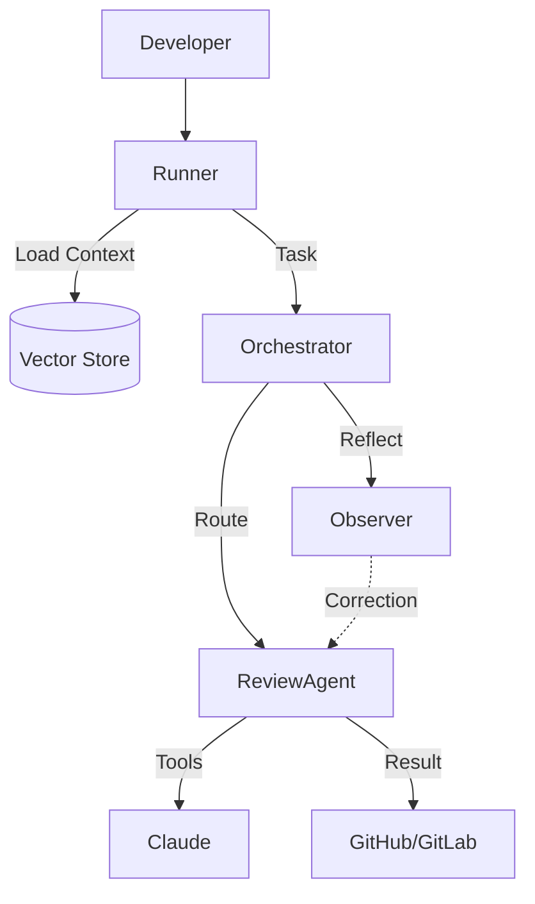

# cicd-ai-toolkit - 产品需求文档 (PRD)

> 基于 Claude Code Headerless 模式的可插拔 CI/CD 工具集

---

## 1. 项目定位

### 1.1 概述

| 属性         | 值                                                       |
| ------------ | -------------------------------------------------------- |
| **项目名称** | `cicd-ai-toolkit`                                        |
| **目标**     | 基于 Claude Code 构建可插拔 CI/CD 工具集，提升效能与质量 |
| **定位**     | Claude Agents 的企业级 CI/CD 运行器                      |
| **开发者**   | 独立开发者                                               |
| **分发方式** | 容器镜像 + 单二进制 Runner                               |
| **当前状态** | **Ready for Development**                               |

### 1.2 核心价值

**Go Runner + Native Skills 架构:**

| 组件       | 职责                                           |
| ---------- | ---------------------------------------------- |
| **Runner (Go)** | 负责"脏活累活"（Git操作、API调用、进程管理、成本控制） |
| **Brain (Claude)** | 负责"思考与决策"（代码理解、模式识别、逻辑分析） |
| **Skills (Markdown)** | 负责"定义能力"（提示词工程、工具定义） |

这种架构最大程度降低了维护成本，同时最大化了 Claude 的原生能力。

### 1.3 目标用户

| 用户群体           | 需求场景                     |
| ------------------ | ---------------------------- |
| **DevOps 工程师**  | CI/CD 流水线智能化改造       |
| **工程团队**       | 代码质量自动化审查           |
| **开源项目维护者** | PR 审查效率提升              |
| **企业研发团队**   | Gitee/GitLab 私有部署集成    |

---

## 2. 背景与趋势

### 2.1 Claude Code 核心能力

#### 基本命令

| 命令                            | 说明                | CI/CD 相关性           |
| ------------------------------- | ------------------- | ---------------------- |
| `claude -p "query"`             | Headless/Print 模式 | ⭐⭐⭐ 核心 CI/CD 集成点  |
| `claude -c`                     | 继续最近会话        | 调试和恢复             |
| `cat file \| claude -p "query"` | 管道输入处理        | ⭐⭐⭐ 日志分析、数据处理 |
| `claude --agents '{...}'`       | 动态定义子 Agent    | ⭐⭐ 任务专业化          |
| `claude -r "<session>"`         | 恢复会话            | 长任务恢复             |

#### 关键 CLI Flags (CI/CD 场景)

| Flag                             | 说明                 | CI/CD 用途       |
| -------------------------------- | -------------------- | ---------------- |
| `-p, --print`                    | 非交互模式           | ⭐ CI/CD 集成核心 |
| `--output-format stream-json`    | 流式 JSON 输出       | ⭐ 结果解析       |
| `--allowedTools`                 | 允许的工具白名单     | ⭐ 安全控制       |
| `--dangerously-skip-permissions` | 跳过权限确认         | 自动化场景       |
| `--max-turns`                    | 最大执行轮数         | 控制执行深度     |
| `--max-budget-usd`               | 最大 API 花费        | ⭐ 成本控制       |
| `--json-schema`                  | JSON Schema 输出验证 | ⭐ 结构化输出     |

#### 可编程接口

1. **SDK 输出格式**: `text`, `json`, `stream-json`
2. **输入格式**: `text`, `stream-json`
3. **JSON Schema**: 结构化输出验证
4. **MCP (Model Context Protocol)**: 扩展能力

#### 核心集成模式

**Context Injection Strategy (上下文注入策略):**

1. **Project Context (`CLAUDE.md`)**: 项目架构、代码风格、关键目录说明
2. **Task Context (Stdin/Prompt)**: 通过管道传入 Git Diff、Linter Report
3. **Explicit File Context (`@`)**: 在 Prompt 中显式引用关键文件

**Output Parsing Strategy (输出解析策略):**

1. **JSON Schema Enforcing**: 强制要求 JSON 格式
2. **Output Extraction**: 解析 stdout，提取 JSON 代码块
3. **Stream Processing**: 监听 `stream-json` 格式

**Smart Chunking & Context Pruning (智能分片):**

针对大型 PR (Diff > 1000行 或 Token > 32k):
- 自动移除 `*.lock`, `vendor/`, `dist/` 等非源码文件
- 按文件或模块粒度切分 Context
- 串行/并行提交多个 Session，汇总结果

---

### 2.2 AI 赋能 CI/CD 应用场景

| 场景              | 描述                     | 价值       |
| ----------------- | ------------------------ | ---------- |
| 智能代码审查      | 超越传统 Lint 的主观审查 | 质量提升   |
| 自动化 Issue 分类 | 智能标签和优先级         | 效率提升   |
| 变更总结          | 自动生成 Changelog       | 沟通效率   |
| 测试用例生成      | 基于代码变更生成测试     | 覆盖率提升 |
| 故障诊断          | 日志分析和根因定位       | MTTR 降低  |
| 安全扫描          | 语义级安全分析           | 安全性提升 |
| 文档生成          | API 文档、架构图         | 维护效率   |

---

### 2.3 行业趋势 (2026)

#### Autonomous Delivery Maturity Model

| 等级   | 名称                  | 特征                                                  | 典型工具 (2026)                          |
| :----- | :-------------------- | :---------------------------------------------------- | :--------------------------------------- |
| **L1** | **Task Automation**   | 脚本化自动化，人类定义所有步骤                        | Jenkins Pipelines, Legacy GitHub Actions |
| **L2** | **Semi-Autonomous**   | Agent 执行特定任务 (Review/Test)，人类编排            | GitHub Copilot Workspace, GitLab Duo     |
| **L3** | **Highly Autonomous** | Agent 自主决策分支合并、回滚，人类仅处理异常          | **cicd-ai-toolkit**, Devin for DevOps    |
| **L4** | **Fully Autonomous**  | 多 Agent 协作 (Swarm)，自主优化架构与成本，零接触交付 | Proprietary Enterprise Brains            |

#### 2026 Engineering Trends

| 趋势                    | 描述                                     | 影响                                                |
| ----------------------- | ---------------------------------------- | --------------------------------------------------- |
| **Multi-Agent Systems** | 多智能体协作成为主流，A2A 协议兴起       | 需要支持 Agent 间的通信与协作编排                   |
| **Self-Healing CI/CD**  | 管道自我诊断和修复能力                   | 引入自愈智能体，自动处理构建失败                    |
| **Reflective Agents**   | 智能体具备自我观察和改进能力 (VIGIL模式) | 运行时需包含观察者(Observer)和纠正者(Corrector)角色 |
| **MCP 协议**            | Model Context Protocol 成为标准          | 全面采用 MCP 对接外部工具和上下文                   |
| **Active Memory**       | 向量存储与长期记忆                       | Agent 能够从历史任务中学习，避免重复错误            |

**Agentic DevOps**: 从 "辅助编码" 进化为 "自主运维"。Agent 不仅写代码，还负责测试、部署和故障修复的闭环。

---

## 3. 产品规格

### 3.1 核心需求

#### 核心痛点 (按优先级)

| 痛点领域       | 具体需求                                 | AI 赋能点              |
| -------------- | ---------------------------------------- | ---------------------- |
| **代码质量**   | 性能问题、安全漏洞、逻辑缺陷、灾难性设计 | 深度语义分析、架构审查 |
| **测试效率**   | 测试生成、覆盖率优化、智能选择           | AI 测试用例生成        |
| **交付速度**   | 自动化重复任务、快速反馈                 | 流程自动化、智能决策   |
| **运维稳定性** | 故障诊断、日志分析、根因定位             | AI 故障分析            |

#### 技术栈选择

- **Runner 架构**: Go (核心运行器) + Claude Code (CLI)
- **Skills 定义**: Markdown (标准) + Python/Bash (脚本)

---

### 3.2 支持平台

| 平台              | 优先级 | 状态           |
| ----------------- | ------ | -------------- |
| **GitHub Actions** | Tier 1 | MVP 优先支持   |
| **Gitee Enterprise** | Tier 1 - P0 | 企业级核心支持 |
| **GitLab CI/CD**   | Tier 2 | Phase 2 支持   |
| **Jenkins**        | Legacy | Phase 2 支持   |
| **Multi-Cloud / Hybrid** | Architecture Ready | 架构预留 |

#### Gitee Enterprise 适配策略

由于 Gitee Go (Gitea Actions) 底层基于 `act_runner`，与 GitHub Actions 高度兼容：

1. **Action 兼容**: 直接复用 `action.yml` 定义
2. **API 适配**: 内置 `GiteeClient` (OAuth2 + API v5)
3. **Webhook 统一**: 标准化 GitHub 和 Gitee 事件为内部 `ReviewEvent`

---

### 3.3 功能模块 (Skills)

#### Phase 1 (MVP) - 核心技能

| 技能名称            | 功能描述                     | 演进目标 (v2.0)                                            | 优先级 | 形式                          |
| ------------------- | ---------------------------- | ---------------------------------------------------------- | ------ | ----------------------------- |
| **Code Reviewer**   | 性能、安全、逻辑、架构分析   | 多阶段审查: Haiku→Sonnet→Opus; 历史记忆: 避免重复评论      | P0     | Skill (Prompt + Linter Tools) |
| **Test Generator**  | 基于代码变更生成测试用例     | 自验证: 生成后自动运行; 属性测试: 引入 QuickCheck/Hypothesis | P0     | Skill (Prompt + Test Runner)  |
| **Change Analyzer** | PR 总结、影响分析、风险评分  | 依赖图谱: 分析变更传播路径; 破壁检测: API 破坏性变更       | P1     | Skill (Prompt + Git Stats)    |
| **Log Analyzer**    | 日志分析、异常检测、根因定位 | 模式识别: 关联历史故障库                                  | P1     | Skill (Prompt + Log Parser)   |

#### Phase 2 - 扩展技能

| 技能名称             | 功能描述                    | 优先级 | 形式                                |
| -------------------- | --------------------------- | ------ | ----------------------------------- |
| **Security Scanner** | 语义级安全分析、供应链检查  | P1     | Skill (Integration with Trivy/Snyk) |
| **Perf Auditor**     | 性能回归检测、优化建议      | P2     | Skill (Integration with k6/JMeter)  |
| **Doc Generator**    | API 文档、架构图、Changelog | P2     | Skill (Mermaid/OpenAPI tools)       |
| **Compliance Check** | IaC 审查、策略验证          | P2     | Skill (OPA/TFSec)                   |

#### Phase 3 - 未来技能 (2026 Roadmap)

| 技能名称                 | 功能描述                   | 核心特性                                                         |
| :----------------------- | :------------------------- | :--------------------------------------------------------------- |
| **Self-Healing Agent**   | CI/CD 失败时自动诊断和修复 | 自动尝试修正依赖版本、配置超时、资源分配；需人工审批的高风险操作 |
| **Performance Profiler** | 代码级性能影响分析         | 对比基准测试结果，自动检测 N+1 查询、不必要的内存分配等反模式    |
| **Security Scanner Pro** | 高级安全漏洞检测           | 结合 Semgrep/CodeQL，支持 CVSS 评分与自动阻断                    |
| **Compliance Auditor**   | 法律与合规性自动审计       | GDPR/SOC2/HIPAA 策略即代码检查                                   |

---

## 4. 技术架构

### 4.1 架构设计 (Runner + Skills)

#### 可插拔架构

```
┌─────────────────────────────────────────────────────────────────┐
│                      cicd-ai-toolkit                             │
│  ┌─────────────────────────────────────────────────────────┐   │
│  │                    Runner (Go)                          │   │
│  │  - Context Builder (Git/Logs)                           │   │
│  │  - Platform API Client (GitHub/GitLab)                  │   │
│  │  - Claude Session Manager                               │   │
│  │  - Result Reporter                                      │   │
│  └─────────────────────────────────────────────────────────┘   │
│                           │                                     │
│                   (Spawns Subprocess)                           │
│                           ▼                                     │
│  ┌─────────────────────────────────────────────────────────┐   │
│  │                   Claude Code                           │   │
│  │           (Headless / Agent Mode)                       │   │
│  └────────┬───────────────────────────────────────┬────────┘   │
│           │ (Loads)                               │ (Loads)    │
│  ┌────────▼────────┐                     ┌────────▼────────┐   │
│  │  Skill: Review  │                     │  Skill: Test    │   │
│  │   (SKILL.md)    │                     │   (SKILL.md)    │   │
│  │   (linter.py)   │                     │   (jest-run.sh) │   │
│  └─────────────────┘                     └─────────────────┘   │
└─────────────────────────────────────────────────────────────────┘
```

#### Runner 流程

1. **Init**: 加载配置，识别目标平台 (GitHub/GitLab/Gitee)
2. **Context**: 从 Git 获取 diff，从 Linter 获取报告
3. **Session**: 启动 `claude` 子进程，注入 Context
4. **Execute**: 指示 Claude 加载指定 Skills
5. **Report**: 解析 Claude 的 JSON 输出，调用平台 API 发表评论

#### 关键优势

1. **原生集成**: 直接利用 Claude Code 的工具发现和执行能力
2. **开发简便**: Skill 仅需 Markdown 定义和脚本，无需编译二进制
3. **生态兼容**: 可直接使用 Anthropic 官方或社区的 Skills

---

### 4.2 技术栈

| 层级             | 技术选择               | 说明                                    |
| ---------------- | ---------------------- | --------------------------------------- |
| **Runner**       | Go 1.21+               | 负责环境准备、认证、结果回传            |
| **Intelligence** | Claude Code            | 负责推理、工具调用                      |
| **Skills**       | Markdown + Python/Bash | 定义能力的标准格式                      |
| **配置**         | YAML                   | 定义启用哪些 Skills 及其参数            |
| **容器**         | Docker/OCI             | 包含 Runner + Claude Code + 预置 Skills |

---

### 4.3 目录结构

```
cicd-ai-toolkit/
├── cmd/                    # Go Runner 入口
│   └── cicd-runner/       # 主命令
├── pkg/                    # Go 核心库
│   ├── runner/            # 运行器逻辑
│   ├── platform/          # 平台适配器 (GitHub/GitLab/Gitee)
│   ├── build-context/     # 上下文构建 (Diff/Tree)
│   └── claude/            # Claude 进程管理
├── skills/                 # 内置 Skills (标准结构)
│   ├── code-reviewer/
│   │   ├── SKILL.md       # 技能定义
│   │   └── scripts/       # 辅助脚本
│   ├── test-generator/
│   │   ├── SKILL.md
│   │   └── scripts/
│   └── change-analyzer/
│       └── SKILL.md
├── configs/                # 配置示例
├── .github/                # GitHub Actions 集成
│   └── workflows/
├── Dockerfile
├── go.mod
└── README.md
```

---

### 4.4 配置文件

```yaml
# .cicd-ai-toolkit.yaml
version: "1.0"

# Claude Code 配置
claude:
  model: "sonnet"           # sonnet | opus | haiku
  max_budget_usd: 5.0       # 成本控制
  max_turns: 10             # 最大轮数
  timeout: 300s             # 超时时间

# 技能配置
skills:
  - name: code-reviewer
    path: ./skills/code-reviewer
    enabled: true
    config:
      severity_threshold: "warning"

  - name: change-analyzer
    enabled: true
    priority: 1

# 平台配置
platform:
  github:
    post_comment: true
    fail_on_error: false
    max_comment_length: 65536

  gitee:
    api_url: "https://gitee.com/api/v5"
    post_comment: true
    enterprise_id: ""

  gitlab:
    post_comment: true
    fail_on_error: false

# 全局配置
global:
  log_level: "info"
  cache_dir: ".cicd-ai-cache"
```

---

### 4.5 平台集成

#### GitHub Actions

```yaml
# .github/workflows/ai-review.yml
name: AI Code Review
on:
  pull_request:
    types: [opened, synchronize]

jobs:
  ai-review:
    runs-on: ubuntu-latest
    steps:
      - uses: actions/checkout@v4
        with:
          fetch-depth: 0

      - name: AI Code Review
        uses: cicd-ai-toolkit/action@v1
        with:
          run_skills: "code-reviewer,change-analyzer"
          config: .cicd-ai-toolkit.yaml
          github_token: ${{ secrets.GITHUB_TOKEN }}
```

#### Gitee Go (Gitea Actions)

```yaml
# .gitee/workflows/ai-review.yml
name: AI Code Review
on: [pull_request]

jobs:
  ai-review:
    runs-on: ubuntu-latest
    steps:
      - uses: actions/checkout@v4

      - name: AI Code Review
        uses: cicd-ai-toolkit/action@v1
        with:
          run_skills: "code-reviewer"
          config: .cicd-ai-toolkit.yaml
          gitee_token: ${{ secrets.GITEE_TOKEN }}
          gitee_api_url: "https://api.gitee.com/v5"
```

---

### 4.6 高级特性

#### Multi-Agent Orchestration

引入 **Unions** 模式的编排层，支持复杂任务的拆解与协作：

- **Router**: 根据用户意图将任务路由给专职 Agent
- **DAG Workflow**: 支持有向无环图的任务流执行
- **A2A Communication**: Agent 间通信协议

#### Reflective Runtime (VIGIL Pattern)

赋予 Agent 自我修正能力：

- **Observer**: 监控 Agent 的输出和工具调用结果
- **Corrector**: 当检测到幻觉或工具错误时，注入修正提示词
- **Retry Logic**: 在消耗额外 Token 与保证正确性之间取得平衡

#### Memory & Knowledge Base

集成 **Vector Store** (如 MemOS 或 ChromaDB) 实现长期记忆：

- **Review History**: 存储历史审查意见，避免重复报错
- **RAG Context**: 检索项目特定的编码规范作为 Prompt 上下文



#### MCP (Model Context Protocol) 集成

**Dual-Layer MCP Strategy:**

1. **Infrastructure Context (Runner hosted)**
   - `get_env_info`: 获取 CI 运行环境
   - `get_secrets`: 安全获取部署密钥

2. **Domain Context (External MCP Servers)**
   - **Issue Tracker MCP** (Jira/Linear): 获取需求描述、验收标准
   - **Observability MCP** (Prometheus/Datadog): 获取性能基线

#### Policy-as-Code for Agents

集成 Open Policy Agent (OPA) 进行 Agent 治理：

```rego
package cicd.agent.authz

# 禁止 Agent 在周五下午自动合并代码
deny[msg] {
    input.action == "merge_pr"
    input.agent_role == "autonomous"
    time.weekday(time.now_ns()) == "Friday"
    time.clock(time.now_ns())[0] >= 16
    msg := "Autonomous agents cannot merge on Friday afternoons"
}

# 高风险变更需人工审批
deny[msg] {
    input.action == "deploy_prod"
    input.risk_score >= 8.0
    not input.human_approved
    msg := "High risk deployment requires human approval"
}
```

---

## 5. 实施路线图

### 5.1 Phase 1: MVP (预计 4-6 周)

**目标**: 可用的代码审查 + 变更分析工具

| 任务          | 说明                                  | 产出              |
| ------------- | ------------------------------------- | ----------------- |
| 核心 Runner   | 上下文构建、平台适配、Claude 进程管理 | Go Runner         |
| Skills 移植   | 将 Prompt 移植为 `SKILL.md` 标准格式  | Skill Definitions |
| GitHub Action | 封装 Runner 为 Action                 | action.yml        |
| 文档          | README、配置示例、快速开始            | Docs              |

### 5.2 Phase 2: 扩展 (预计 6-8 周)

| 功能         | 说明            |
| ------------ | --------------- |
| GitLab CI    | 平台适配、MR 评论 |
| 测试生成插件 | AI 测试用例生成 |
| 安全深度扫描 | 语义级安全分析  |
| 性能基准     | 性能回归检测    |
| Jenkins 支持 | Jenkins 插件    |

### 5.3 Phase 3: 企业化 (预计 4-6 周)

| 功能       | 说明             |
| ---------- | ---------------- |
| 监控可观测 | Metrics、Tracing |
| 权限安全   | RBAC、审计日志   |
| 性能优化   | 并发处理、缓存   |

### 5.4 Phase 4: Advanced Agents (2026 Roadmap)

| 任务              | 类别  | 优先级 | 说明                               |
| ----------------- | ----- | ------ | ---------------------------------- |
| **Self-Healing**  | Agent | P1     | 实现 CI 失败自动修复闭环           |
| **Orchestrator**  | 架构  | P1     | 实现多智能体 DAG 编排引擎          |
| **Memory System** | 架构  | P2     | 集成向量数据库，实现长期记忆 (RAG) |
| **Reflective**    | 架构  | P2     | 实现 VIGIL 模式的运行时自我修正    |

---

## 6. 质量与安全

### 6.1 性能要求

| 指标         | 目标值               |
| ------------ | -------------------- |
| 单次分析耗时 | < 60s (中等 PR，P90) |
| 内存占用     | < 512MB (CLI)        |
| 冷启动时间   | < 5s                 |
| 缓存命中率   | > 40% (目标)         |

#### Result Caching Strategy

两级缓存策略：

1. **File-Level Cache**: 计算 `Hash(FileContent + SkillInstruction)`
2. **Global Cache**: 存储在 CI 系统的 Cache 挂载卷或 S3 中

### 6.2 可靠性要求

| 指标     | 目标值                         |
| -------- | ------------------------------ |
| 可用性   | 99.5% (本地运行)               |
| 降级策略 | Claude 不可用时跳过，不阻塞 CI |
| 幂等性   | 重复运行结果一致               |

### 6.3 安全要求

| 要求         | 说明                                                                                                                                                   |
| ------------ | ------------------------------------------------------------------------------------------------------------------------------------------------------ |
| API Key      | 从环境变量读取，不写入配置                                                                                                                             |
| 代码隐私     | 仅发送 diff，不发送完整代码库                                                                                                                          |
| 审计日志     | 记录所有 API 调用                                                                                                                                      |
| 输出验证     | JSON Schema 验证所有输出                                                                                                                               |
| **沙箱隔离** | **Strict Sandboxing**: Runner 运行在 Read-Only RootFS 容器中，仅挂载 `/workspace` 和 `/tmp`。网络层仅允许访问 Anthropic API 和内部 Git/Artifact 仓库。 |

---

## 7. 生态与运营

### 7.1 开源策略

| 项目     | 许可证    |
| -------- | --------- |
| 主项目   | Apache 2.0 |
| 文档     | CC BY 4.0 |

### 7.2 社区建设

- GitHub Issues 讨论和追踪
- Contributing Guide
- RFC 流程 (重大变更)
- Roadmap 公开

#### 贡献与生态激励 (2026 模型)

- **Contributors**: 传统的代码贡献
- **Workflow-as-a-Service**: 允许社区开发者将复杂的 Skill 组合打包成 Workflows
- **Skill Marketplace**: 官方维护 Skills 索引，支持 "Verified Skills" 认证

### 7.3 竞品分析

#### 竞品对比

| 项目                            | 类型 | 技术栈     | 特点                       |
| ------------------------------- | ---- | ---------- | -------------------------- |
| **claude-code-security-review** | 官方 | Python     | 专注安全审查，单点解决方案 |
| **pr-agent (qodo-ai)**          | 开源 | Python     | 功能全面，PR 全流程支持    |
| **claude-code-action**          | 官方 | TypeScript | 通用 GitHub Action         |

#### cicd-ai-toolkit 差异化定位

| 维度         | cicd-ai-toolkit | pr-agent | claude-code-security-review |
| ------------ | --------------- | -------- | --------------------------- |
| **核心技术** | Claude Code 原生 | 通用 LLM API | Claude Code 原生            |
| **架构**     | Runner + Skills | 单体架构 | 单体架构                    |
| **性能**     | Go 高性能 Runner | Python   | Python                      |
| **分发**     | 单二进制 + 容器  | Python 包 / 容器 | 容器                    |
| **扩展性**   | Skills (Markdown) | 配置定制 | 配置定制                    |
| **功能范围** | 质量 + 测试 + 运维 | PR 全流程 | 安全专项                    |

**核心差异化:**

1. **Claude Code 原生集成**: 利用工具生态 (Bash, Edit, Read, MCP)
2. **Agent Skills 架构**: 社区驱动的技能生态 (`SKILL.md`)
3. **Go Runner + Native Skills**: 稳健的流程控制 + 智能决策
4. **深度代码分析**: 性能、安全、架构层面审查

#### 生态复用策略

**外部生态复用:**
- PR 压缩策略 (pr-agent)
- False Positive 过滤 (claude-code-security-review)
- 配置文件设计 (YAML/TOML)
- 平台适配器抽象

**核心创新领域:**
- Claude Code 原生集成方案
- Agent Skills 编排引擎 (Runner)
- 深度代码分析能力

---

## 附录

### A. 技能定义标准 (SKILL.md)

**文件位置**: `skills/<skill-name>/SKILL.md`

**内容规范**:
````markdown
---
name: code-reviewer
description: Analyzes code changes using advanced reasoning.
options:
  thinking:
    budget_tokens: 4096
  tools:
    - grep
    - ls
---

# Code Review Process

You are an expert code reviewer acting as a quality gate.

## Analysis Scope
Review the provided code diffs. Output a `<thinking>` block to analyze:
1. Architectural Impact
2. Security & Data Flow
3. Concurrency

## Output Format
```xml
<thinking>
[Step-by-step reasoning]
</thinking>
<json>
{
  "issues": [
    {
      "severity": "critical | high | medium | low",
      "file": "string",
      "line": "number",
      "category": "security | performance | logic | style",
      "message": "string",
      "suggestion": "string"
    }
  ]
}
</json>
```
````

### B. Runner 实现细节 (Go)

```go
// Runner Implementation of Context Injection
func (r *Runner) Review(ctx context.Context, diff string) error {
    // 1. Build Command
    args := []string{
        "-p", "Execute code-reviewer skill. Input diff is provided via stdin.",
        "--dangerously-skip-permissions",
    }

    cmd := exec.CommandContext(ctx, "claude", args...)
    cmd.Stdin = strings.NewReader(diff)

    // 2. Capture Output
    output, err := cmd.CombinedOutput()
    if err != nil {
        return fmt.Errorf("claude execution failed: %v, output: %s", err, output)
    }

    // 3. Parse JSON from Markdown block
    findings, err := r.extractJSON(output)
    if err != nil {
        return err
    }

    // 4. Post to Platform
    return r.Platform.PostComment(findings)
}
```

### C. 资料来源

- [Claude Code CLI Reference](https://code.claude.com/docs/en/cli-reference)
- [Anthropic Agent Skills](https://github.com/anthropic/agent-skills)
- [Model Context Protocol](https://modelcontextprotocol.io/)

---

**文档版本**: v2.0
**最后更新**: 2026-01-27
