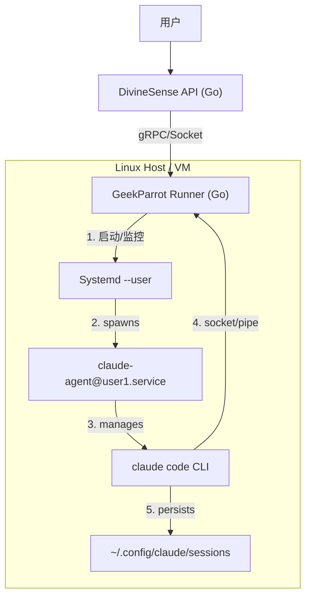

# 调研报告：构建生产级持久化 CLI Agent 最佳实践

## 1. 摘要

本报告旨在为 DivineSense 提供构建生产级、基于二进制文件运行的持久化 CLI Agent (GeekParrot) 的最佳实践方案。我们的目标是摒弃对 Docker 容器的依赖，直接在宿主机（裸金属或虚拟机）上通过二进制文件运行，同时确保高可用性、健壮的进程管理、用户会话隔离与持久化，以及可观测性。

通过对行业最佳实践（包括 `supervisord`, `systemd`, `pm2`, 以及 Golang 原生进程管理库）的深入调研，我们提出了一套基于 **Systemd 用户服务 (User Services)** 结合 **Golang 原生 Sidecar 模式** 的架构方案。该方案利用 Linux 原生能力解决进程托管与重启，通过 Golang 实现精细化的状态机控制与 IO 管理，是目前构建此类“有状态后端 (Stateful Backend)”的最优解。

## 2. 核心挑战分析

在非容器化环境中运行长期存活的 CLI Agent 面临以下核心挑战：

1.  **进程生命周期管理**：如何确保 `claude` CLI 进程在意外崩溃后自动重启？如何确保父进程（Go Runner）退出时，子进程不会变成僵尸进程？
2.  **多租户隔离**：多个用户同时使用时，如何确保文件系统、环境变量和会话数据的隔离？
3.  **IO 健壮性**：标准管道（Pipe）在处理大量数据或非标准输出时容易阻塞或死锁。
4.  **资源限制**：防止某个用户的 Agent 占用过多 CPU/内存导致整机宕机。
5.  **持久化与迁移**：在没有 Docker Volume 的情况下，如何优雅地管理会话文件。

## 3. 行业方案对比

| 方案                                           | 描述                                                               | 优点                                                                       | 缺点                                               | 适用场景                                   |
| :--------------------------------------------- | :----------------------------------------------------------------- | :------------------------------------------------------------------------- | :------------------------------------------------- | :----------------------------------------- |
| **Golang Native (Supervisor Libs)**            | 在 Go 代码中集成 `ochinchina/supervisord` 或 `struCoder/pmgo` 库。 | 一体化部署，无外部依赖；跨平台（Win/Mac/Linux）。                          | 重新造轮子，稳定性不如系统级工具；主进程崩了全崩。 | 开发环境、跨平台桌面应用。                 |
| **External Process Manager (PM2/Supervisord)** | 使用 Python 的 `supervisord` 或 Node 的 `pm2` 管理 Go 二进制。     | 成熟稳定，不仅能管 Go，还能管 Python 脚本。                                | 引入了 Python/Node 运行时依赖；增加了运维复杂度。  | 传统运维环境，多语言混合栈。               |
| **Systemd Services (System Mode)**             | 使用 root 权限的 systemd 管理服务。                                | Linux 标准，极其稳定，开机自启，Cgroups 资源控制。                         | 权限过大，难以管理多用户动态生成的 Agent。         | 系统级守护进程（如 Nginx, Docker）。       |
| **Systemd User Services (User Mode)**          | **(推荐)** 每个用户通过 `systemd --user` 管理即服务。              | **完美契合多租户**；权限隔离；利用系统级保活；Lingering 模式支持离线任务。 | 仅限 Linux；需要配置 PAM/Logind。                  | **多租户、持久化、高安全要求的生产环境。** |

## 4. 最佳实践架构方案：基于 Systemd User Unit 的 Sidecar 模式

我们推荐采用 **Systemd User Unit** 作为底层的进程管理器，配合 **Go Runner (作为 Controller)** 进行业务逻辑控制。

### 4.1 架构设计



### 4.2 关键实施细节

#### A. 进程托管：Systemd Template Units
使用 Systemd 的 **模板单元 (Template Units)** 功能，为每个用户动态生成服务。

创建文件 `~/.config/systemd/user/claude-agent@.service`:

```ini
[Unit]
Description=Claude Code Agent for user %i
After=network.target

[Service]
# 核心：服务类型
Type=simple
# 自动重启策略
Restart=always
RestartSec=3
# 资源限制 (Cgroups)
CPUQbota=50%
MemoryMax=1G

# 启动命令 (指定 Session 和 Socket 模式)
# 注意：这里我们建议通过 Socket/TCP 而非 Stdin 通信，更稳定
ExecStart=/usr/local/bin/claude code --session %i --server-mode --port %h

# 环境变量隔离
Environment="CLAUDE_CONFIG_DIR=%h/.config/claude/user_%i"

[Install]
WantedBy=default.target
```

#### B. 通信升级：从 Pipe 到 Socket/RPC
目前的 Pipe 方案在长会话中极易出问题（缓冲区死锁）。最佳实践是将 CLI 包装为一个微型 **RPC Server** 或 **Socket Server**。

*   **如果 CLI 支持 Server 模式**：直接使用。
*   **如果 CLI 仅支持 Stdin/out**：编写一个极小的 **Golang Adapter**。
    *   这个 Adapter 是 Systemd 实际启动的进程。
    *   Adapter 启动 CLI，并通过 PTY (伪终端) 与 CLI 交互（解决缓冲问题）。
    *   Adapter 暴露一个 Unix Domain Socket 给 DivineSense 主程序。
*   **上下文清空机制 (Context Reset)**：
    *   在 Socket 协议中定义 `Reset` 指令。
    *   收到指令后，Adapter 负责向 CLI 发送 `/clear` 命令（若支持）或直接重启 CLI 子进程并清理会话文件。
    *   这实现了**逻辑上的上下文清空**，而无需 DivineSense 主程序重新建立连接。

#### C. 会话持久化与 Lingering
利用 Systemd 的 `loginctl enable-linger <username>` 功能。
*   即使 Go Runner 重启了，或者 SSH 断开了，Systemd User Manager 依然活着。
*   CLI 进程依然活着。
*   Go Runner 重启后，只需重新连接到对应的 Unix Socket，**状态瞬间恢复，零延迟**。

### 4.3 目录结构规范

为了符合 Linux FHS 标准并确保可维护性：

*   **二进制文件**: `/opt/divinesense/bin/runner`
*   **用户数据**: `/var/lib/divinesense/users/<user_id>/`
    *   `sessions/`: 存放 Claude CLI 的 session 文件
    *   `sockets/`: 存放通信用的 Unix Domain Sockets
*   **日志**: `/var/log/divinesense/agent_<user_id>.log` (Systemd 自动接管到 journald)

## 5. 迁移路线图 (Migration Path)

1.  **阶段一：适配器开发 (The Adapter)**
    *   开发一个轻量级的 `agent-adapter` 二进制。它负责启动 `claude` CLI，处理 PTY 交互，并暴露 gRPC 接口。
    *   **获益**：解决 IO 阻塞和死锁问题，解耦业务逻辑与进程管理。

2.  **阶段二：引入 Systemd 管理**
    *   编写 Systemd Unit 模板文件。
    *   修改 `GeekParrot` 代码：不再调用 `exec.Command`，而是调用 `systemctl --user start claude-agent@<uuid>`。

3.  **阶段三：全量裸机部署**
    *   编写 Ansible/Shell 脚本，自动配置 Lingering、创建用户目录结构。
    *   彻底移除 Docker 依赖。

## 6. 结论

放弃 Docker 采用二进制部署是一个非常明智的决定，特别是在这种重状态（Stateful）的场景下。Docker 的临时文件系统和网络隔离在持久化 CLI 会话时反而是累赘。

通过 **Systemd User Services**，我们免费获得了操作系统级别的进程保活、日志管理和资源隔离能力。结合 **Socket 通信** 替代脆弱的 Pipe 通信，将构建出一个极其稳固、可从故障中毫秒级恢复的“不朽”Agent 系统。

## 7. 附录：Claude Code CLI 接口规范 (实时更新)

经过实际调试 (2026-01-30)，我们确定了 Claude Code CLI (v2.1.15) 在无头模式下的正确调用参数。这是实现 GeekParrot 稳定运行的关键。

### 7.1 核心参数组合

| 功能 | 必需参数 | 说明 |
| :--- | :--- | :--- |
| **无头模式** | `--print` | 禁用交互式 UI，直接输出结果并退出。 |
| **流式输出** | `--output-format stream-json` | 输出 JSON 格式的流事件（包括 thinking, text, tools）。 |
| **详细模式** | **`--verbose`** | **关键！** 使用 `stream-json` 时必须开启，否则会报错。 |
| **系统提示词** | `--append-system-prompt "..."` | 注入系统级指令 (System Context)。 |

### 7.2 会话管理策略 (Session Persistence)

CLI 提供了多种会话管理方式，经过测试，只有 **Explicit ID Strategy** 是生产环境可靠的。

#### ❌ 方式 A: 基于 CWD (Directory-based)
*   **命令**: `--continue`
*   **行为**: 继续当前目录下最近更改的 session。
*   **问题**: 在多租户或并发环境下极不可靠；如果多个 session 文件都在同一目录，很难确定捡起的是哪一个。

#### ✅ 方式 B: 显式 ID (Explicit ID) - 推荐
*   **首次调用 (Init)**:
    ```bash
    claude --print --verbose --output-format stream-json \
      --session-id <UUID> \
      "User Prompt"
    ```
*   **后续调用 (Resume)**:
    ```bash
    claude --print --verbose --output-format stream-json \
      --resume <UUID> \
      "User Prompt"
    ```
*   **说明**: 
    - 使用 `--resume <UUID>` 可以精准定位会话，不受文件修改时间影响。
    - 注意：如果 `session-id` 已经被占用（例如前一个进程未正常退出），Init 命令可能会报错。建议配合超时重试机制。

### 7.3 注意事项
1.  **Process Isolation**: `claude` CLI 自身是单例的 (Singleton-ish) 还是多实例安全的，取决于 Session 文件的锁机制。建议确保同一 Session ID 在同一时间只有一个 CLI 进程在操作。
2.  **Output Parsing**: `stream-json` 模式下，Standard Output 会包含多行 JSON 对象。
    - 消息类型: `message`, `content_block_delta` (streaming text), `tool_use`, `result`.
    - 错误处理: 需监听 stderr 以及 stdout 中的 `error` 类型消息。
