# CICD AI Toolkit - 实施计划

**Version**: 1.0
**Date**: 2026-01-24
**Author**: CICD AI Toolkit Team
**Status**: Draft

## 1. 概述 (Overview)

本文档基于 32 个技术规范 (Specs) 的依赖关系，规划了 CICD AI Toolkit 的分阶段实施计划。计划采用分层架构方法，确保依赖关系正确处理，核心功能优先交付。

### 1.1 规范覆盖

| 类别      | Spec 数量 | 覆盖 PRD 需求   |
| --------- | --------- | --------------- |
| **CORE**  | 3         | Runner 核心架构 |
| **CONF**  | 2         | 配置与幂等性    |
| **PLAT**  | 7         | 平台适配器      |
| **SEC**   | 3         | 安全与沙箱      |
| **GOV**   | 2         | 治理与质量门禁  |
| **PERF**  | 1         | 缓存与性能      |
| **OPS**   | 1         | 可观测性        |
| **SKILL** | 1         | Skill 定义标准  |
| **LIB**   | 4         | 标准技能库      |
| **MCP**   | 2         | MCP 集成        |
| **ECO**   | 1         | 技能市场        |
| **DIST**  | 1         | 分发机制        |
| **RFC**   | 1         | RFC 流程        |
| **STATS** | 1         | 可用性保障      |
| **HOOKS** | 1         | 集成钩子        |
| **总计**  | **32**    | **100%**        |

## 2. 依赖关系图 (Dependency Graph)

### 2.1 Mermaid 依赖图

```mermaid
graph TD
    %% Foundation Layer
    CONF01[CONFIG-01<br/>Configuration]
    SKILL01[SKILL-01<br/>Skill Definition]
    DIST01[DIST-01<br/>Distribution]

    %% Core Layer
    CORE02[CORE-02<br/>Context Chunking]
    CORE01[CORE-01<br/>Runner Lifecycle]
    CORE03[CORE-03<br/>Output Parsing]

    %% Platform Layer
    PLAT01[PLAT-01<br/>Platform Adapter]
    PLAT02[PLAT-02<br/>Async Execution]
    PLAT03[PLAT-03<br/>GitLab Adapter]
    PLAT04[PLAT-04<br/>Jenkins Plugin]
    PLAT05[PLAT-05<br/>Composite Actions]
    PLAT06[PLAT-06<br/>Gitee Adapter]
    PLAT07[PLAT-07<br/>Project Structure]

    %% Security Layer
    SEC01[SEC-01<br/>Sandboxing]
    SEC02[SEC-02<br/>Prompt Injection]
    SEC03[SEC-03<br/>RBAC]
    GOV01[GOV-01<br/>Policy As Code]

    %% Skills Layer
    LIB01[LIB-01<br/>Standard Skills]
    LIB02[LIB-02<br/>Extended Skills]
    LIB03[LIB-03<br/>Doc Generator]
    LIB04[LIB-04<br/>Compliance Check]

    %% Advanced Layer
    PERF01[PERF-01<br/>Caching]
    OPS01[OPS-01<br/>Observability]
    ECO01[ECO-01<br/>Marketplace]
    MCP01[MCP-01<br/>Dual Layer]
    MCP02[MCP-02<br/>External Integrations]

    %% Other
    CONF02[CONF-02<br/>Idempotency]
    GOV02[GOV-02<br/>Quality Gates]
    HOOKS01[HOOKS-01<br/>Integration]
    STATS01[STATS-01<br/>Availability]
    RFC01[RFC-01<br/>RFC Process]

    %% Dependencies
    CONF01 --> CORE01
    SKILL01 --> CORE01
    SKILL01 --> CORE03
    SKILL01 --> LIB01
    SKILL01 --> LIB02
    SKILL01 --> LIB03
    SKILL01 --> LIB04
    SKILL01 --> PLAT05
    SKILL01 --> ECO01
    SKILL01 --> MCP02
    SKILL01 --> RFC01

    CORE02 --> CORE01
    CORE01 --> CORE03
    CORE01 --> PLAT01
    CORE01 --> SEC01
    CORE01 --> HOOKS01

    PLAT01 --> PLAT02
    PLAT01 --> PLAT03
    PLAT01 --> PLAT04
    PLAT01 --> PLAT06
    PLAT06 --> SEC03

    DIST01 --> PLAT05
    DIST01 --> LIB02

    GOV01 --> SEC03
    GOV01 --> LIB04
    CORE02 --> GOV02

    PERF01 <--> CONF02
    CONF01 --> CONF02

    OPS01 --> CONF02
    OPS01 --> GOV02
    OPS01 --> STATS01

    MCP01 --> MCP02
    SKILL01 --> PLAT07
    CORE01 --> PLAT07

    %% Layer styling
    classDef foundation fill:#e3f2fd,stroke:#1565c0,stroke-width:2px
    classDef core fill:#f3e5f5,stroke:#6a1b9a,stroke-width:2px
    classDef platform fill:#e8f5e9,stroke:#2e7d32,stroke-width:2px
    classDef security fill:#ffebee,stroke:#c62828,stroke-width:2px
    classDef skills fill:#fff3e0,stroke:#ef6c00,stroke-width:2px
    classDef advanced fill:#fce4ec,stroke:#880e4f,stroke-width:2px

    class CONF01,SKILL01,DIST01 foundation
    class CORE01,CORE02,CORE03 core
    class PLAT01,PLAT02,PLAT03,PLAT04,PLAT05,PLAT06,PLAT07 platform
    class SEC01,SEC02,SEC03,GOV01 security
    class LIB01,LIB02,LIB03,LIB04 skills
    class PERF01,OPS01,ECO01,MCP01,MCP02,CONF02,GOV02,HOOKS01,STATS01,RFC01 advanced
```



### 2.2 关键路径分析

| 路径                | 描述                                  | 长度 |
| ------------------- | ------------------------------------- | ---- |
| **Critical Path 1** | CONF-01 → CORE-01 → PLAT-01 → PLAT-06 | 4    |
| **Critical Path 2** | SKILL-01 → CORE-01 → CORE-02 → GOV-02 | 4    |
| **Critical Path 3** | CONF-01 → CONF-02 ↔ PERF-01 → OPS-01  | 4    |

**关键依赖瓶颈：**
- `SPEC-CORE-01` 被最多其他 Spec 依赖 (13 个)
- `SPEC-SKILL-01` 是所有 LIB 和部分 PLAT Spec 的基础 (10 个依赖)
- `SPEC-PLAT-01` 是所有平台适配器的基础 (5 个依赖)

## 3. 分层实施计划 (Layered Implementation)

### 3.1 Phase 0: 项目基础设施 (Week 1)

**目标**: 搭建开发环境和项目结构

| Spec                            | 优先级 | 复杂度 | 状态      |
| ------------------------------- | ------ | ------ | --------- |
| SPEC-PLAT-07: Project Structure | P0     | Low    | Completed |
| SPEC-DIST-01: Distribution      | P0     | Medium | Completed |

**交付物：**
- [ ] Go 项目脚手架 (`cmd/`, `pkg/`, `internal/`)
- [ ] CI/CD Pipeline (GitHub Actions)
- [ ] Docker 构建配置
- [ ] 版本发布流程

### 3.2 Phase 1: 基础层 (Foundation) (Week 2-3)

**目标**: 实现配置系统和 Skill 定义标准

| Spec                            | PRD 覆盖   | 复杂度 | 状态      |
| ------------------------------- | ---------- | ------ | --------- |
| SPEC-CONF-01: Configuration     | AR-4       | Medium | Completed |
| SPEC-SKILL-01: Skill Definition | AR-3, AR-5 | Medium | Completed |
| SPEC-CONF-02: Idempotency       | NFR-6      | High   | Completed |

**交付物：**
- [ ] 配置加载系统 (YAML + Env Vars)
- [ ] SKILL.md 解析器
- [ ] 幂等性保证机制 (SHA256 指纹)
- [ ] 单元测试覆盖率 > 80%

**验收标准：**
- ✅ CONF-01: 能通过环境变量覆盖配置
- ✅ SKILL-01: 能解析 SKILL.md 并提取元数据
- ✅ CONF-02: 相同输入产生相同输出

### 3.3 Phase 2: 核心层 (Core) (Week 4-6)

**目标**: 实现 Runner 核心生命周期

| Spec                           | PRD 覆盖    | 复杂度 | 状态        |
| ------------------------------ | ----------- | ------ | ----------- |
| SPEC-CORE-02: Context Chunking | AR-2, NFR-7 | High   | Completed   |
| SPEC-CORE-01: Runner Lifecycle | AR-1, NFR-5 | High   | In Progress |
| SPEC-CORE-03: Output Parsing   | AR-6        | Medium | Completed   |
| SPEC-SEC-02: Prompt Injection  | NFR-9       | Medium | Completed   |

**交付物：**
- [ ] Git Diff 分析器
- [ ] Context Chunk 分片算法 (24000 tokens)
- [ ] Claude Process Manager (启动/停止/超时控制)
- [ ] IO 重定向管道
- [ ] 输出解析器 (XML-wrapped JSON)
- [ ] Prompt 注入防护

**验收标准：**
- ✅ CORE-01: 冷启动 < 5s (NFR-5)
- ✅ CORE-02: 中等 PR 分片 < 10 个
- ✅ CORE-03: 解析成功率 > 95%

### 3.4 Phase 3: 平台适配层 (Platform) (Week 7-10)

**目标**: 实现主流 CI/CD 平台适配

| Spec                            | PRD 覆盖 | 复杂度 | 状态      |
| ------------------------------- | -------- | ------ | --------- |
| SPEC-PLAT-01: Platform Adapter  | PF-1~4   | High   | Completed |
| SPEC-PLAT-02: Async Execution   | NFR-10   | Medium | Completed |
| SPEC-PLAT-03: GitLab Adapter    | PF-3     | Medium | Completed |
| SPEC-PLAT-04: Jenkins Plugin    | PF-4     | Medium | Completed |
| SPEC-PLAT-06: Gitee Adapter     | PF-2     | Medium | Completed |
| SPEC-PLAT-05: Composite Actions | AR-7     | Low    | Completed |

**交付物：**
- [ ] Platform Interface (Go Interface)
- [ ] GitHub Adapter 实现
- [ ] GitLab Adapter 实现
- [ ] Gitee Adapter 实现
- [ ] Jenkins Plugin (Java)
- [ ] 异步执行引擎 (状态更新机制)
- [ ] Composite Actions DSL

**验收标准：**
- ✅ PLAT-01: 统一接口抽象
- ✅ PLAT-03/04/06: 能获取 PR Diff 和发表评论
- ✅ PLAT-02: 支持超 60s 分析的异步执行

### 3.5 Phase 4: 安全与治理 (Security & Governance) (Week 11-13)

**目标**: 实现安全隔离和策略控制

| Spec                        | PRD 覆盖 | 复杂度 | 状态      |
| --------------------------- | -------- | ------ | --------- |
| SPEC-SEC-01: Sandboxing     | NFR-8    | High   | Completed |
| SPEC-SEC-03: RBAC           | GOV-2    | High   | Completed |
| SPEC-GOV-01: Policy As Code | GOV-1    | High   | Completed |
| SPEC-GOV-02: Quality Gates  | GOV-3    | Medium | Completed |

**交付物：**
- [ ] Docker 沙箱隔离
- [ ] 工具使用白名单机制
- [ ] OPA 策略引擎集成
- [ ] RBAC 权限模型
- [ ] 质量门禁规则引擎

**验收标准：**
- ✅ SEC-01: 沙箱逃逸测试通过
- ✅ GOV-01: OPA 策略正确拦截违规操作
- ✅ GOV-02: 能定义和执行质量门禁

### 3.6 Phase 5: 标准技能库 (Skills Library) (Week 14-17)

**目标**: 实现内置技能

| Spec                          | PRD 覆盖 | 复杂度 | 状态      |
| ----------------------------- | -------- | ------ | --------- |
| SPEC-LIB-01: Standard Skills  | FR-1~6   | High   | Completed |
| SPEC-LIB-02: Extended Skills  | FR-1~6   | Medium | Completed |
| SPEC-LIB-03: Doc Generator    | FR-7     | Medium | Completed |
| SPEC-LIB-04: Compliance Check | FR-8     | High   | Completed |

**交付物：**
- [ ] Code Reviewer Skill
- [ ] Test Generator Skill
- [ ] Bug Explainer Skill
- [ ] Refactor Suggester Skill
- [ ] Performance Profiler Skill
- [ ] Security Auditor Skill
- [ ] Doc Generator Skill (OpenAPI + Mermaid)
- [ ] Compliance Check Skill (IaC 扫描)

**验收标准：**
- ✅ LIB-01: 6 个标准 Skill 可用
- ✅ LIB-03: 能生成 OpenAPI 文档
- ✅ LIB-04: 能检测 Terraform 安全问题

### 3.7 Phase 6: 高级特性 (Advanced Features) (Week 18-20)

**目标**: 性能优化和可观测性

| Spec                        | PRD 覆盖     | 复杂度 | 状态      |
| --------------------------- | ------------ | ------ | --------- |
| SPEC-PERF-01: Caching       | NFR-4        | High   | Completed |
| SPEC-OPS-01: Observability  | NFR-1, NFR-3 | High   | Completed |
| SPEC-HOOKS-01: Integration  | AR-7         | Medium | Completed |
| SPEC-STATS-01: Availability | NFR-2        | Medium | Completed |

**交付物：**
- [ ] 两级缓存系统 (L1 Memory + L2 File)
- [ ] 结构化日志 (JSON)
- [ ] Prometheus 指标
- [ ] 审计日志 (Audit Trail)
- [ ] 资源监控 (内存 < 512MB)
- [ ] 集成钩子系统
- [ ] 可用性 SLO 监控

**验收标准：**
- ✅ PERF-01: 缓存命中 > 70%，P90 < 60s
- ✅ OPS-01: 日志 JSON 格式，指标完整
- ✅ STATS-01: 可用性 > 99.5%

### 3.8 Phase 7: 生态系统 (Ecosystem) (Week 21-22)

**目标**: MCP 集成和技能市场

| Spec                                 | PRD 覆盖 | 复杂度 | 状态      |
| ------------------------------------ | -------- | ------ | --------- |
| SPEC-MCP-01: Dual Layer Architecture | ECO-2    | High   | Completed |
| SPEC-MCP-02: External Integrations   | ECO-2    | High   | Completed |
| SPEC-ECO-01: Skill Marketplace       | ECO-1    | Medium | Completed |
| SPEC-RFC-01: RFC Process             | ECO-3    | Low    | Completed |

**交付物：**
- [ ] MCP Server 实现
- [ ] MCP 集成层
- [ ] 外部工具集成框架
- [ ] Skill Marketplace MVP
- [ ] RFC 提交流程

**验收标准：**
- ✅ MCP-01: 内部/外部 MCP 正常工作
- ✅ ECO-01: 能安装社区 Skill

## 4. 开发进展跟踪矩阵 (Development Progress Tracking Matrix)

### 4.1 主矩阵

| ID       | Spec 名称               | Phase | 依赖              | 开始日期 | 结束日期 | 进度 | 状态        | 阻塞                   |
| -------- | ----------------------- | ----- | ----------------- | -------- | -------- | ---- | ----------- | ---------------------- |
| ID       | Spec 名称               | Phase | 依赖              | 开始日期 | 结束日期 | 进度 | 状态        | 阻塞                   |
| -------- | ----------------------- | ----- | ----------------- | -------- | -------- | ---- | ----------- | ---------------------- |
| PLAT-07  | Project Structure       | 0     | -                 | Week 1   | Week 1   | 100% | Completed   | -                      |
| DIST-01  | Distribution            | 0     | -                 | Week 1   | Week 1   | 100% | Completed   | -                      |
| CONF-01  | Configuration           | 1     | -                 | Week 2   | Week 2   | 100% | Completed   | -                      |
| SKILL-01 | Skill Definition        | 1     | -                 | Week 2   | Week 2   | 100% | Completed   | -                      |
| CONF-02  | Idempotency             | 1     | CONF-01           | Week 3   | Week 3   | 100% | Completed   | -                      |
| CORE-02  | Context Chunking        | 2     | -                 | Week 4   | Week 4   | 100% | Completed   | -                      |
| SEC-02   | Prompt Injection        | 2     | CORE-02           | Week 5   | Week 5   | 100% | Completed   | -                      |
| CORE-01  | Runner Lifecycle        | 2     | CONF-01, SKILL-01 | Week 5   | Week 5   | 50%  | In Progress | -                      |
| CORE-03  | Output Parsing          | 2     | CORE-01, SKILL-01 | Week 6   | Week 6   | 100% | Completed   | -                      |
| PLAT-01  | Platform Adapter        | 3     | CORE-01           | Week 7   | Week 7   | 100% | Completed   | -                      |
| PLAT-03  | GitLab Adapter          | 3     | PLAT-01           | Week 8   | Week 8   | 100% | Completed   | -                      |
| PLAT-06  | Gitee Adapter           | 3     | PLAT-01           | Week 9   | Week 9   | 100% | Completed   | -                      |
| PLAT-04  | Jenkins Plugin          | 3     | PLAT-01           | Week 10  | Week 10  | 100% | Completed   | -                      |
| PLAT-02  | Async Execution         | 3     | PLAT-01           | Week 10  | Week 10  | 100% | Completed   | -                      |
| PLAT-05  | Composite Actions       | 3     | DIST-01           | Week 21  | Week 21  | 100% | Completed   | -                      |
| SEC-01   | Sandboxing              | 4     | CORE-01           | Week 11  | Week 11  | 100% | Completed   | -                      |
| GOV-01   | Policy As Code (OPA)    | 4     | -                 | Week 11  | Week 11  | 100% | Completed   | -                      |
| SEC-03   | RBAC                    | 4     | GOV-01, SEC-01    | Week 12  | Week 12  | 100% | Completed   | -                      |
| GOV-02   | Quality Gates           | 4     | CORE-02           | Week 12  | Week 12  | 100% | Completed   | -                      |
| LIB-01   | Standard Skills         | 5     | SKILL-01          | Week 14  | Week 14  | 100% | Completed   | -                      |
| LIB-04   | Compliance Check        | 5     | SKILL-01, GOV-01  | Week 15  | Week 15  | 100% | Completed   | -                      |
| LIB-02   | Extended Skills         | 5     | SKILL-01, DIST-01 | Week 16  | Week 16  | 100% | Completed   | -                      |
| LIB-03   | Doc Generator           | 5     | SKILL-01          | Week 16  | Week 16  | 100% | Completed   | -                      |
| PERF-01  | Caching                 | 6     | CONF-02           | Week 18  | Week 18  | 100% | Completed   | -                      |
| HOOKS-01 | Integration             | 6     | CORE-01, SEC-01   | Week 18  | Week 18  | 100% | Completed   | -                      |
| OPS-01   | Observability           | 6     | CONF-02           | Week 19  | Week 19  | 100% | Completed   | -                      |
| STATS-01 | Availability            | 6     | -                 | Week 20  | Week 20  | 100% | Completed   | -                      |
| MCP-01   | Dual Layer Architecture | 7     | -                 | Week 21  | Week 21  | 100% | Completed   | -                      |
| MCP-02   | External Integrations   | 7     | MCP-01, SKILL-01  | Week 21  | Week 21  | 100% | Completed   | -                      |
| ECO-01   | Skill Marketplace       | 7     | SKILL-01          | Week 22  | Week 22  | 100% | Completed   | -                      |
| RFC-01   | RFC Process             | 7     | SKILL-01          | Week 22  | Week 22  | 100% | Completed   | -                      |

### 4.2 状态定义

| 状态            | 说明                 |
| --------------- | -------------------- |
| **Pending**     | 未开始，等待依赖完成 |
| **In Progress** | 开发中               |
| **Review**      | 代码审查中           |
| **Testing**     | 测试中               |
| **Completed**   | 已完成               |
| **Blocked**     | 被阻塞，需要外部解决 |

### 4.3 进度计算

```
总进度 = (已完成 Spec 数 / 32) × 100%
Phase 进度 = (Phase 内已完成 Spec 数 / Phase 总 Spec 数) × 100%
```

## 5. 里程碑 (Milestones)

| 里程碑           | 日期    | 交付物            | 验收标准                        | 状态        |
| ---------------- | ------- | ----------------- | ------------------------------- | ----------- |
| **M0: 项目启动** | Week 1  | 项目结构 + CI/CD  | 能构建和发布                    | Completed   |
| **M1: 基础就绪** | Week 3  | 配置 + Skill 定义 | 能加载配置和解析 Skill          | Completed   |
| **M2: 核心 MVP** | Week 6  | Runner 核心功能   | 能运行 Claude 并解析输出        | In Progress |
| **M3: 平台集成** | Week 10 | 3 个平台适配器    | 能在 GitHub/GitLab/Gitee 上运行 | Completed   |
| **M4: 安全合规** | Week 13 | 沙箱 + 治理       | 通过安全测试，OPA 策略生效      | Completed   |
| **M5: 技能完整** | Week 17 | 8 个内置 Skill    | 所有 FR 功能可用                | Completed   |
| **M6: 生产就绪** | Week 20 | 性能 + 可观测性   | 满足所有 NFR                    | Completed   |
| **M7: 生态开放** | Week 22 | MCP + Marketplace | 社区可扩展                      | Completed   |

## 6. 风险与缓解 (Risks & Mitigations)

| 风险                | 影响         | 概率 | 缓解措施                        |
| ------------------- | ------------ | ---- | ------------------------------- |
| **依赖 Spec 延期**  | 阻塞后续开发 | 高   | 提前启动无依赖的 Spec；并行开发 |
| **Claude API 变更** | 接口不兼容   | 中   | 版本锁定；抽象层隔离            |
| **性能不达标**      | P90 > 60s    | 中   | 早期性能测试；预留优化时间      |
| **安全漏洞**        | 沙箱逃逸     | 低   | 第三方安全审计；模糊测试        |
| **人员变动**        | 知识流失     | 中   | 文档完善；代码审查              |


## 8. 更新日志 (Changelog)

| 版本 | 日期       | 变更                                             |
| ---- | ---------- | ------------------------------------------------ |
| 1.0  | 2026-01-24 | 初始版本，基于 32 个 Specs 创建实施计划          |
| 1.1  | 2026-01-26 | 移除多人协作开发模式相关内容，调整为通用实施计划 |
