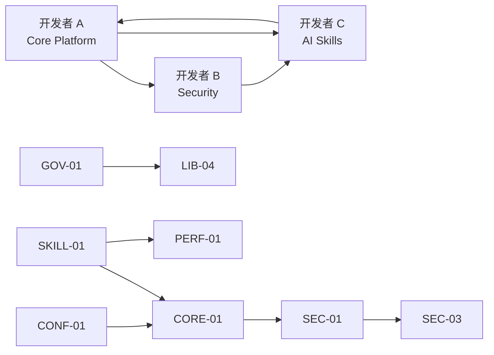

# CICD AI Toolkit - 实施计划

**Version**: 1.0
**Date**: 2026-01-24
**Author**: CICD AI Toolkit Team
**Status**: Draft

## 1. 概述 (Overview)

本文档基于 32 个技术规范 (Specs) 的依赖关系，规划了 CICD AI Toolkit 的分阶段实施计划。计划采用分层架构方法，确保依赖关系正确处理，核心功能优先交付。

### 1.1 规范覆盖

| 类别 | Spec 数量 | 覆盖 PRD 需求 |
|------|-----------|---------------|
| **CORE** | 3 | Runner 核心架构 |
| **CONF** | 2 | 配置与幂等性 |
| **PLAT** | 7 | 平台适配器 |
| **SEC** | 3 | 安全与沙箱 |
| **GOV** | 2 | 治理与质量门禁 |
| **PERF** | 1 | 缓存与性能 |
| **OPS** | 1 | 可观测性 |
| **SKILL** | 1 | Skill 定义标准 |
| **LIB** | 4 | 标准技能库 |
| **MCP** | 2 | MCP 集成 |
| **ECO** | 1 | 技能市场 |
| **DIST** | 1 | 分发机制 |
| **RFC** | 1 | RFC 流程 |
| **STATS** | 1 | 可用性保障 |
| **HOOKS** | 1 | 集成钩子 |
| **总计** | **32** | **100%** |

## 2. 依赖关系图 (Dependency Graph)

### 2.1 Mermaid 依赖图


### 2.2 关键路径分析

| 路径 | 描述 | 长度 |
|------|------|------|
| **Critical Path 1** | CONF-01 → CORE-01 → PLAT-01 → PLAT-06 | 4 |
| **Critical Path 2** | SKILL-01 → CORE-01 → CORE-02 → GOV-02 | 4 |
| **Critical Path 3** | CONF-01 → CONF-02 ↔ PERF-01 → OPS-01 | 4 |

**关键依赖瓶颈：**
- `SPEC-CORE-01` 被最多其他 Spec 依赖 (13 个)
- `SPEC-SKILL-01` 是所有 LIB 和部分 PLAT Spec 的基础 (10 个依赖)
- `SPEC-PLAT-01` 是所有平台适配器的基础 (5 个依赖)

## 3. 分层实施计划 (Layered Implementation)

### 3.1 Phase 0: 项目基础设施 (Week 1)

**目标**: 搭建开发环境和项目结构

| Spec | 优先级 | 复杂度 | 负责人 | 状态 |
|------|--------|--------|--------|------|
| SPEC-PLAT-07: Project Structure | P0 | Low | 开发者 A | Not Started |
| SPEC-DIST-01: Distribution | P0 | Medium | 开发者 B | Not Started |

**交付物：**
- [ ] Go 项目脚手架 (`cmd/`, `pkg/`, `internal/`)
- [ ] CI/CD Pipeline (GitHub Actions)
- [ ] Docker 构建配置
- [ ] 版本发布流程

### 3.2 Phase 1: 基础层 (Foundation) (Week 2-3)

**目标**: 实现配置系统和 Skill 定义标准

| Spec | PRD 覆盖 | 复杂度 | 负责人 | 状态 |
|------|----------|--------|--------|------|
| SPEC-CONF-01: Configuration | AR-4 | Medium | 开发者 A | Not Started |
| SPEC-SKILL-01: Skill Definition | AR-3, AR-5 | Medium | 开发者 C | Not Started |
| SPEC-CONF-02: Idempotency | NFR-6 | High | 开发者 A | Not Started |

**交付物：**
- [ ] 配置加载系统 (YAML + Env Vars)
- [ ] SKILL.md 解析器
- [ ] 幂等性保证机制 (SHA256 指纹)
- [ ] 单元测试覆盖率 > 80%

**验收标准：**
- ✅ CONF-01: 能通过环境变量覆盖配置
- ✅ SKILL-01: 能解析 SKILL.md 并提取元数据
- ✅ CONF-02: 相同输入产生相同输出

### 3.3 Phase 2: 核心层 (Core) (Week 4-6)

**目标**: 实现 Runner 核心生命周期

| Spec | PRD 覆盖 | 复杂度 | 负责人 | 状态 |
|------|----------|--------|--------|------|
| SPEC-CORE-02: Context Chunking | AR-2, NFR-7 | High | 开发者 A | Not Started |
| SPEC-CORE-01: Runner Lifecycle | AR-1, NFR-5 | High | 开发者 A | Not Started |
| SPEC-CORE-03: Output Parsing | AR-6 | Medium | 开发者 A | Not Started |
| SPEC-SEC-02: Prompt Injection | NFR-9 | Medium | 开发者 B | Not Started |

**交付物：**
- [ ] Git Diff 分析器
- [ ] Context Chunk 分片算法 (24000 tokens)
- [ ] Claude Process Manager (启动/停止/超时控制)
- [ ] IO 重定向管道
- [ ] 输出解析器 (XML-wrapped JSON)
- [ ] Prompt 注入防护

**验收标准：**
- ✅ CORE-01: 冷启动 < 5s (NFR-5)
- ✅ CORE-02: 中等 PR 分片 < 10 个
- ✅ CORE-03: 解析成功率 > 95%

### 3.4 Phase 3: 平台适配层 (Platform) (Week 7-10)

**目标**: 实现主流 CI/CD 平台适配

| Spec | PRD 覆盖 | 复杂度 | 负责人 | 状态 |
|------|----------|--------|--------|------|
| SPEC-PLAT-01: Platform Adapter | PF-1~4 | High | 开发者 A | Not Started |
| SPEC-PLAT-02: Async Execution | NFR-10 | Medium | 开发者 A | Not Started |
| SPEC-PLAT-03: GitLab Adapter | PF-3 | Medium | 开发者 A | Not Started |
| SPEC-PLAT-04: Jenkins Plugin | PF-4 | Medium | 开发者 A | Not Started |
| SPEC-PLAT-06: Gitee Adapter | PF-2 | Medium | 开发者 A | Not Started |
| SPEC-PLAT-05: Composite Actions | AR-7 | Low | 开发者 B | Not Started |

**交付物：**
- [ ] Platform Interface (Go Interface)
- [ ] GitHub Adapter 实现
- [ ] GitLab Adapter 实现
- [ ] Gitee Adapter 实现
- [ ] Jenkins Plugin (Java)
- [ ] 异步执行引擎 (状态更新机制)
- [ ] Composite Actions DSL

**验收标准：**
- ✅ PLAT-01: 统一接口抽象
- ✅ PLAT-03/04/06: 能获取 PR Diff 和发表评论
- ✅ PLAT-02: 支持超 60s 分析的异步执行

### 3.5 Phase 4: 安全与治理 (Security & Governance) (Week 11-13)

**目标**: 实现安全隔离和策略控制

| Spec | PRD 覆盖 | 复杂度 | 负责人 | 状态 |
|------|----------|--------|--------|------|
| SPEC-SEC-01: Sandboxing | NFR-8 | High | 开发者 B | Not Started |
| SPEC-SEC-03: RBAC | GOV-2 | High | 开发者 B | Not Started |
| SPEC-GOV-01: Policy As Code | GOV-1 | High | 开发者 B | Not Started |
| SPEC-GOV-02: Quality Gates | GOV-3 | Medium | 开发者 B | Not Started |

**交付物：**
- [ ] Docker 沙箱隔离
- [ ] 工具使用白名单机制
- [ ] OPA 策略引擎集成
- [ ] RBAC 权限模型
- [ ] 质量门禁规则引擎

**验收标准：**
- ✅ SEC-01: 沙箱逃逸测试通过
- ✅ GOV-01: OPA 策略正确拦截违规操作
- ✅ GOV-02: 能定义和执行质量门禁

### 3.6 Phase 5: 标准技能库 (Skills Library) (Week 14-17)

**目标**: 实现内置技能

| Spec | PRD 覆盖 | 复杂度 | 负责人 | 状态 |
|------|----------|--------|--------|------|
| SPEC-LIB-01: Standard Skills | FR-1~6 | High | 开发者 C | Not Started |
| SPEC-LIB-02: Extended Skills | FR-1~6 | Medium | 开发者 C | Not Started |
| SPEC-LIB-03: Doc Generator | FR-7 | Medium | 开发者 C | Not Started |
| SPEC-LIB-04: Compliance Check | FR-8 | High | 开发者 C | Not Started |

**交付物：**
- [ ] Code Reviewer Skill
- [ ] Test Generator Skill
- [ ] Bug Explainer Skill
- [ ] Refactor Suggester Skill
- [ ] Performance Profiler Skill
- [ ] Security Auditor Skill
- [ ] Doc Generator Skill (OpenAPI + Mermaid)
- [ ] Compliance Check Skill (IaC 扫描)

**验收标准：**
- ✅ LIB-01: 6 个标准 Skill 可用
- ✅ LIB-03: 能生成 OpenAPI 文档
- ✅ LIB-04: 能检测 Terraform 安全问题

### 3.7 Phase 6: 高级特性 (Advanced Features) (Week 18-20)

**目标**: 性能优化和可观测性

| Spec | PRD 覆盖 | 复杂度 | 负责人 | 状态 |
|------|----------|--------|--------|------|
| SPEC-PERF-01: Caching | NFR-4 | High | 开发者 B | Not Started |
| SPEC-OPS-01: Observability | NFR-1, NFR-3 | High | 开发者 B | Not Started |
| SPEC-HOOKS-01: Integration | AR-7 | Medium | 开发者 A | Not Started |
| SPEC-STATS-01: Availability | NFR-2 | Medium | 开发者 B | Not Started |

**交付物：**
- [ ] 两级缓存系统 (L1 Memory + L2 File)
- [ ] 结构化日志 (JSON)
- [ ] Prometheus 指标
- [ ] 审计日志 (Audit Trail)
- [ ] 资源监控 (内存 < 512MB)
- [ ] 集成钩子系统
- [ ] 可用性 SLO 监控

**验收标准：**
- ✅ PERF-01: 缓存命中 > 70%，P90 < 60s
- ✅ OPS-01: 日志 JSON 格式，指标完整
- ✅ STATS-01: 可用性 > 99.5%

### 3.8 Phase 7: 生态系统 (Ecosystem) (Week 21-22)

**目标**: MCP 集成和技能市场

| Spec | PRD 覆盖 | 复杂度 | 负责人 | 状态 |
|------|----------|--------|--------|------|
| SPEC-MCP-01: Dual Layer Architecture | ECO-2 | High | 开发者 C | Not Started |
| SPEC-MCP-02: External Integrations | ECO-2 | High | 开发者 C | Not Started |
| SPEC-ECO-01: Skill Marketplace | ECO-1 | Medium | 开发者 C | Not Started |
| SPEC-RFC-01: RFC Process | ECO-3 | Low | 开发者 C | Not Started |

**交付物：**
- [ ] MCP Server 实现
- [ ] MCP 集成层
- [ ] 外部工具集成框架
- [ ] Skill Marketplace MVP
- [ ] RFC 提交流程

**验收标准：**
- ✅ MCP-01: 内部/外部 MCP 正常工作
- ✅ ECO-01: 能安装社区 Skill

## 4. 开发进展跟踪矩阵 (Development Progress Tracking Matrix)

### 4.1 主矩阵

| ID | Spec 名称 | Phase | 负责人 | 依赖 | 开始日期 | 结束日期 | 进度 | 状态 | 阻塞 |
|----|-----------|-------|--------|------|----------|----------|------|------|------|
| PLAT-07 | Project Structure | 0 | 开发者 A | - | Week 1 | Week 1 | 0% | Pending | - |
| DIST-01 | Distribution | 0 | 开发者 B | - | Week 1 | Week 1 | 0% | Pending | - |
| CONF-01 | Configuration | 1 | 开发者 A | - | Week 2 | Week 2 | 0% | Pending | - |
| SKILL-01 | Skill Definition | 1 | 开发者 C | - | Week 2 | Week 2 | 0% | Pending | - |
| CONF-02 | Idempotency | 1 | 开发者 A | CONF-01 | Week 3 | Week 3 | 0% | Pending | 等待 CONF-01 |
| CORE-02 | Context Chunking | 2 | 开发者 A | - | Week 4 | Week 4 | 0% | Pending | - |
| SEC-02 | Prompt Injection | 2 | 开发者 B | CORE-02 | Week 5 | Week 5 | 0% | Pending | 等待 CORE-02 |
| CORE-01 | Runner Lifecycle | 2 | 开发者 A | CONF-01, SKILL-01 | Week 5 | Week 5 | 0% | Pending | 等待 CONF-01, SKILL-01 |
| CORE-03 | Output Parsing | 2 | 开发者 A | CORE-01, SKILL-01 | Week 6 | Week 6 | 0% | Pending | 等待 CORE-01 |
| PLAT-01 | Platform Adapter | 3 | 开发者 A | CORE-01 | Week 7 | Week 7 | 0% | Pending | 等待 CORE-01 |
| PLAT-03 | GitLab Adapter | 3 | 开发者 A | PLAT-01 | Week 8 | Week 8 | 0% | Pending | 等待 PLAT-01 |
| PLAT-06 | Gitee Adapter | 3 | 开发者 A | PLAT-01 | Week 9 | Week 9 | 0% | Pending | 等待 PLAT-01 |
| PLAT-04 | Jenkins Plugin | 3 | 开发者 A | PLAT-01 | Week 10 | Week 10 | 0% | Pending | 等待 PLAT-01 |
| PLAT-02 | Async Execution | 3 | 开发者 A | PLAT-01 | Week 10 | Week 10 | 0% | Pending | 等待 PLAT-01 |
| PLAT-05 | Composite Actions | 3 | 开发者 B | DIST-01 | Week 21 | Week 21 | 0% | Pending | - |
| SEC-01 | Sandboxing | 4 | 开发者 B | CORE-01 | Week 11 | Week 11 | 0% | Pending | 等待 CORE-01 |
| GOV-01 | Policy As Code (OPA) | 4 | 开发者 B | - | Week 11 | Week 11 | 0% | Pending | - |
| SEC-03 | RBAC | 4 | 开发者 B | GOV-01, SEC-01 | Week 12 | Week 12 | 0% | Pending | 等待 GOV-01, SEC-01 |
| GOV-02 | Quality Gates | 4 | 开发者 B | CORE-02 | Week 12 | Week 12 | 0% | Pending | - |
| LIB-01 | Standard Skills | 5 | 开发者 C | SKILL-01 | Week 14 | Week 14 | 0% | Pending | 等待 SKILL-01 |
| LIB-04 | Compliance Check | 5 | 开发者 C | SKILL-01, GOV-01 | Week 15 | Week 15 | 0% | Pending | 等待 SKILL-01, GOV-01 |
| LIB-02 | Extended Skills | 5 | 开发者 C | SKILL-01, DIST-01 | Week 16 | Week 16 | 0% | Pending | 等待 SKILL-01 |
| LIB-03 | Doc Generator | 5 | 开发者 C | SKILL-01 | Week 16 | Week 16 | 0% | Pending | 等待 SKILL-01 |
| PERF-01 | Caching | 6 | 开发者 B | CONF-02 | Week 18 | Week 18 | 0% | Pending | 等待 CONF-02 |
| HOOKS-01 | Integration | 6 | 开发者 A | CORE-01, SEC-01 | Week 18 | Week 18 | 0% | Pending | 等待 CORE-01, SEC-01 |
| OPS-01 | Observability | 6 | 开发者 B | CONF-02 | Week 19 | Week 19 | 0% | Pending | 等待 CONF-02 |
| STATS-01 | Availability | 6 | 开发者 B | - | Week 20 | Week 20 | 0% | Pending | - |
| MCP-01 | Dual Layer Architecture | 7 | 开发者 C | - | Week 21 | Week 21 | 0% | Pending | - |
| MCP-02 | External Integrations | 7 | 开发者 C | MCP-01, SKILL-01 | Week 21 | Week 21 | 0% | Pending | 等待 MCP-01 |
| ECO-01 | Skill Marketplace | 7 | 开发者 C | SKILL-01 | Week 22 | Week 22 | 0% | Pending | 等待 SKILL-01 |
| RFC-01 | RFC Process | 7 | 开发者 C | SKILL-01 | Week 22 | Week 22 | 0% | Pending | 等待 SKILL-01 |

### 4.2 状态定义

| 状态 | 说明 |
|------|------|
| **Pending** | 未开始，等待依赖完成 |
| **In Progress** | 开发中 |
| **Review** | 代码审查中 |
| **Testing** | 测试中 |
| **Completed** | 已完成 |
| **Blocked** | 被阻塞，需要外部解决 |

### 4.3 进度计算

```
总进度 = (已完成 Spec 数 / 32) × 100%
Phase 进度 = (Phase 内已完成 Spec 数 / Phase 总 Spec 数) × 100%
```

## 5. 里程碑 (Milestones)

| 里程碑 | 日期 | 交付物 | 验收标准 |
|--------|------|--------|----------|
| **M0: 项目启动** | Week 1 | 项目结构 + CI/CD | 能构建和发布 |
| **M1: 基础就绪** | Week 3 | 配置 + Skill 定义 | 能加载配置和解析 Skill |
| **M2: 核心 MVP** | Week 6 | Runner 核心功能 | 能运行 Claude 并解析输出 |
| **M3: 平台集成** | Week 10 | 3 个平台适配器 | 能在 GitHub/GitLab/Gitee 上运行 |
| **M4: 安全合规** | Week 13 | 沙箱 + 治理 | 通过安全测试，OPA 策略生效 |
| **M5: 技能完整** | Week 17 | 8 个内置 Skill | 所有 FR 功能可用 |
| **M6: 生产就绪** | Week 20 | 性能 + 可观测性 | 满足所有 NFR |
| **M7: 生态开放** | Week 22 | MCP + Marketplace | 社区可扩展 |

## 6. 风险与缓解 (Risks & Mitigations)

| 风险 | 影响 | 概率 | 缓解措施 |
|------|------|------|----------|
| **依赖 Spec 延期** | 阻塞后续开发 | 高 | 提前启动无依赖的 Spec；并行开发 |
| **Claude API 变更** | 接口不兼容 | 中 | 版本锁定；抽象层隔离 |
| **性能不达标** | P90 > 60s | 中 | 早期性能测试；预留优化时间 |
| **安全漏洞** | 沙箱逃逸 | 低 | 第三方安全审计；模糊测试 |
| **人员变动** | 知识流失 | 中 | 文档完善；代码审查 |

## 7. 开发者任务分配 (Developer Assignment)

### 7.1 分配策略

基于技术领域、依赖关系和工作量平衡，将 32 个 Specs 分配给 3 位开发者：

| 开发者 | 角色定位 | 技术栈 | Spec 数量 | 工作量 |
|--------|----------|--------|-----------|--------|
| **开发者 A** | Core Platform Engineer | Go, 系统编程, API 集成 | 12 | ~20 人周 |
| **开发者 B** | Security & Infra Engineer | Go, OPA, Docker, Prometheus | 10 | ~18 人周 |
| **开发者 C** | AI & Skills Engineer | Go/Python, LLM, 生态工具 | 10 | ~18 人周 |

### 7.2 开发者 A: Core Platform Engineer

**职责**: Runner 核心引擎、平台适配、配置系统

#### 任务列表

| Spec ID | Spec 名称 | Phase | 复杂度 | 依赖 | 优先级 |
|---------|-----------|-------|--------|------|--------|
| PLAT-07 | Project Structure | 0 | Low | - | P0 |
| CONF-01 | Configuration | 1 | Medium | - | P0 |
| CONF-02 | Idempotency | 1 | High | CONF-01 | P1 |
| CORE-02 | Context Chunking | 2 | High | - | P0 |
| CORE-01 | Runner Lifecycle | 2 | High | CONF-01, SKILL-01 | P0 |
| CORE-03 | Output Parsing | 2 | Medium | CORE-01, SKILL-01 | P1 |
| PLAT-01 | Platform Adapter | 3 | High | CORE-01 | P0 |
| PLAT-02 | Async Execution | 3 | Medium | PLAT-01 | P1 |
| PLAT-03 | GitLab Adapter | 3 | Medium | PLAT-01 | P1 |
| PLAT-04 | Jenkins Plugin | 3 | Medium | PLAT-01 | P1 |
| PLAT-06 | Gitee Adapter | 3 | Medium | PLAT-01 | P1 |
| HOOKS-01 | Integration Hooks | 6 | Medium | CORE-01 | P1 |

#### 工作时间线

```
Week 1:  PLAT-07 (项目结构)
Week 2:  CONF-01 (配置系统)
Week 3:  CONF-02 (幂等性)
Week 4:  CORE-02 (Context 分片)
Week 5:  CORE-01 (Runner 核心)
Week 6:  CORE-03 (输出解析)
Week 7:  PLAT-01 (平台适配器接口)
Week 8:  PLAT-03 (GitLab)
Week 9:  PLAT-06 (Gitee)
Week 10: PLAT-04 (Jenkins) + PLAT-02 (异步)
Week 18: HOOKS-01 (集成钩子)
```

#### 关键交付物

- [ ] Go 项目脚手架和目录结构
- [ ] 配置加载系统 (YAML + Env)
- [ ] 幂等性保证 (SHA256 指纹)
- [ ] Git Diff 分析和 Chunk 分片
- [ ] Claude 进程管理器
- [ ] 输出解析器 (XML-JSON)
- [ ] Platform 接口定义
- [ ] GitHub/GitLab/Gitee/Jenkins 适配器
- [ ] 集成钩子系统

### 7.3 开发者 B: Security & Infrastructure Engineer

**职责**: 安全隔离、策略治理、性能优化、可观测性

#### 任务列表

| Spec ID | Spec 名称 | Phase | 复杂度 | 依赖 | 优先级 |
|---------|-----------|-------|--------|------|--------|
| SEC-01 | Sandboxing | 4 | High | CORE-01 | P0 |
| SEC-02 | Prompt Injection | 2 | Medium | CORE-02 | P1 |
| SEC-03 | RBAC | 4 | High | GOV-01, SEC-01 | P1 |
| GOV-01 | Policy As Code (OPA) | 4 | High | - | P0 |
| GOV-02 | Quality Gates | 4 | Medium | CORE-02 | P1 |
| PERF-01 | Caching Strategy | 6 | High | CONF-02 | P0 |
| OPS-01 | Observability | 6 | High | CONF-02 | P0 |
| STATS-01 | Availability SLA | 6 | Medium | - | P1 |
| DIST-01 | Distribution | 0 | Medium | - | P0 |
| PLAT-05 | Composite Actions | 3 | Low | DIST-01 | P2 |

#### 工作时间线

```
Week 1:  DIST-01 (分发机制)
Week 5:  SEC-02 (Prompt 注入防护) - 并行
Week 11: SEC-01 (Docker 沙箱)
Week 11: GOV-01 (OPA 策略引擎)
Week 12: SEC-03 (RBAC) + GOV-02 (质量门禁)
Week 18: PERF-01 (两级缓存)
Week 19: OPS-01 (日志/指标)
Week 20: STATS-01 (可用性保障)
Week 21: PLAT-05 (Composite Actions)
```

#### 关键交付物

- [ ] Docker 沙箱隔离机制
- [ ] Prompt 注入防护
- [ ] OPA 策略引擎集成
- [ ] RBAC 权限模型
- [ ] 质量门禁规则引擎
- [ ] 两级缓存系统 (L1 Memory + L2 File)
- [ ] 结构化日志 (JSON)
- [ ] Prometheus 指标
- [ ] 审计日志
- [ ] 可用性 SLO 监控
- [ ] CI/CD 发布流程

### 7.4 开发者 C: AI & Skills Engineer

**职责**: Skill 定义标准、技能库实现、MCP 集成、生态建设

#### 任务列表

| Spec ID | Spec 名称 | Phase | 复杂度 | 依赖 | 优先级 |
|---------|-----------|-------|--------|------|--------|
| SKILL-01 | Skill Definition | 1 | Medium | - | P0 |
| LIB-01 | Standard Skills | 5 | High | SKILL-01 | P0 |
| LIB-02 | Extended Skills | 5 | Medium | SKILL-01, DIST-01 | P1 |
| LIB-03 | Doc Generator | 5 | Medium | SKILL-01 | P1 |
| LIB-04 | Compliance Check | 5 | High | SKILL-01, GOV-01 | P1 |
| MCP-01 | Dual Layer Architecture | 7 | High | - | P1 |
| MCP-02 | External Integrations | 7 | High | MCP-01, SKILL-01 | P1 |
| ECO-01 | Skill Marketplace | 7 | Medium | SKILL-01 | P2 |
| RFC-01 | RFC Process | 7 | Low | SKILL-01 | P2 |

#### 工作时间线

```
Week 2:  SKILL-01 (Skill 定义标准)
Week 14: LIB-01 (标准技能库 - Code Reviewer 等)
Week 15: LIB-04 (合规检查) - 等待 GOV-01
Week 16: LIB-02 (扩展技能) + LIB-03 (文档生成)
Week 21: MCP-01 (MCP 架构)
Week 21: MCP-02 (外部集成)
Week 22: ECO-01 (技能市场) + RFC-01 (RFC 流程)
```

#### 关键交付物

- [ ] SKILL.md 解析器和验证
- [ ] Skill 元数据 schema
- [ ] 6 个标准 Skills:
  - [ ] Code Reviewer
  - [ ] Test Generator
  - [ ] Bug Explainer
  - [ ] Refactor Suggester
  - [ ] Performance Profiler
  - [ ] Security Auditor
- [ ] 扩展 Skills (k6, trivy 集成)
- [ ] Doc Generator (OpenAPI + Mermaid)
- [ ] Compliance Check (IaC 扫描)
- [ ] MCP Server 实现
- [ ] 外部工具集成框架
- [ ] Skill Marketplace MVP
- [ ] RFC 提交和评审流程

### 7.5 跨开发者依赖关系



**关键依赖路径**:
1. `SKILL-01 (C)` → `CORE-01 (A)` → `SEC-01 (B)`
2. `CONF-01 (A)` → `CONF-02 (A)` → `PERF-01 (B)`
3. `GOV-01 (B)` → `LIB-04 (C)`

**协调机制**:
- 每周同步会议确认接口变更
- API 契约先行定义
- 共同维护 interface 定义文件

## 8. 更新日志 (Changelog)

| 版本 | 日期 | 变更 |
|------|------|------|
| 1.0 | 2026-01-24 | 初始版本，基于 32 个 Specs 创建实施计划 |
| 1.1 | 2026-01-24 | 添加开发者任务分配章节，将 32 个 Specs 分配给 3 位开发者 |
