# Architecture Specifications Index

> This directory contains the detailed technical specifications (Specs) for the `cicd-ai-toolkit`. Each spec defines a specific component or protocol to ensure the implementation meets the [Product Requirement Document](../PRD.md).

## 1. Specification Coverage Matrix

| Category | Spec ID | Title | Status | Covers PRD Sections |
|:---------|:-------|:-----|:------|:-------------------|
| **Core** | [SPEC-CORE-01](./SPEC-CORE-01-Runner_Lifecycle.md) | Runner Architecture & Lifecycle | Draft | 1.2, 3.4, 5.2 |
| | [SPEC-CORE-02](./SPEC-CORE-02-Context_Chunking.md) | Context Injection & Smart Chunking | Draft | 1.5, 3.5 |
| | [SPEC-CORE-03](./SPEC-CORE-03-Output_Parsing.md) | Output Parsing & XML Handling | Draft | 1.5, 5.2 |
| **Config** | [SPEC-CONF-01](./SPEC-CONF-01-Configuration.md) | Configuration System | Draft | 3.6, 5.3 |
| | [SPEC-CONF-02](./SPEC-CONF-02-Idempotency.md) | Idempotency & Reproducibility | Draft | 5.2 |
| **Platform** | [SPEC-PLAT-01](./SPEC-PLAT-01-Platform_Adapter.md) | Platform Adapter Interface | Draft | 3.3 |
| | [SPEC-PLAT-02](./SPEC-PLAT-02-Async_Execution.md) | Async Execution & Callback | Draft | 5.1, 8.2 |
| | [SPEC-PLAT-03](./SPEC-PLAT-03-GitLab_Adapter.md) | GitLab Adapter (Tier 2) | Draft | 2.1, 3.2 |
| | [SPEC-PLAT-04](./SPEC-PLAT-04-Jenkins_Plugin.md) | Jenkins Plugin (Legacy) | Draft | 2.1 |
| | [SPEC-PLAT-05](./SPEC-PLAT-05-Composite_Actions.md) | GitHub Composite Actions | Draft | 1.2, 3.7 |
| | [SPEC-PLAT-06](./SPEC-PLAT-06-Gitee_Adapter.md) | Gitee Enterprise Adapter (Tier 1) | Draft | 2.1, 3.3, 3.8 |
| | [SPEC-PLAT-07](./SPEC-PLAT-07-Project_Structure.md) | Project Directory Structure | Draft | 3.5 |
| **Security** | [SPEC-SEC-01](./SPEC-SEC-01-Sandboxing.md) | Sandboxing & Container Security | Draft | 5.3 |
| | [SPEC-SEC-02](./SPEC-SEC-02-Prompt_Injection.md) | Prompt Injection Mitigation | Draft | 5.3 |
| | [SPEC-SEC-03](./SPEC-SEC-03-RBAC.md) | Role-Based Access Control | Draft | 4.0, 5.3 |
| **Skills** | [SPEC-SKILL-01](./SPEC-SKILL-01-Skill_Definition.md) | Skill Definition & Standard Schema | Draft | 1.2, 8.3 |
| | [SPEC-LIB-01](./SPEC-LIB-01-Standard_Skills.md) | Standard Skills Library | Draft | 1.3, 2.2 |
| | [SPEC-LIB-02](./SPEC-LIB-02-Extended_Skills.md) | Extended Skills Library (Phase 2) | Draft | 2.2 |
| **Governance** | [SPEC-GOV-01](./SPEC-GOV-01-Policy_As_Code.md) | Policy-as-Code Governance (OPA) | Draft | 2.2, 5.3 |
| | [SPEC-GOV-02](./SPEC-GOV-02-Quality_Gates.md) | Quality Gates & Risk Scoring | Draft | 2.2 |
| **Ops & Perf** | [SPEC-OPS-01](./SPEC-OPS-01-Observability.md) | Observability & Audit | Draft | 4.3, 5.1, 5.3 |
| | [SPEC-PERF-01](./SPEC-PERF-01-Caching.md) | Two-Level Caching Strategy | Draft | 5.1 |
| **Arch** | [SPEC-MCP-01](./SPEC-MCP-01-Dual_Layer_Architecture.md) | Dual-Layer MCP Architecture | Draft | 1.5, 3.3 |
| | [SPEC-MCP-02](./SPEC-MCP-02-External_Integrations.md) | External MCP Integrations | Draft | 9.1 |
| **Dist** | [SPEC-DIST-01](./SPEC-DIST-01-Distribution.md) | Distribution & Installation | Draft | 3.1, 3.2 |
| **Ecosystem** | [SPEC-ECO-01](./SPEC-ECO-01-Skill_Marketplace.md) | Skill Marketplace & Ecosystem | Draft | 6.3 |
| **Integration** | [SPEC-HOOKS-01](./SPEC-HOOKS-01-Integration.md) | Claude Code Hooks Integration | Draft | 1.1 |
| **Process** | [SPEC-RFC-01](./SPEC-RFC-01-Process.md) | RFC (Request for Comments) Process | Draft | 6.2 |
| **Quality** | [SPEC-STATS-01](./SPEC-STATS-01-Availability.md) | Availability & SLA Calculation | Draft | 5.2 |

## 2. Component Dependency Graph

```mermaid
graph TD
    classDef core fill:#e1f5fe,stroke:#01579b,stroke-width:2px;
    classDef sec fill:#ffebee,stroke:#b71c1c,stroke-width:2px;
    classDef skill fill:#f3e5f5,stroke:#4a148c,stroke-width:2px;
    classDef plat fill:#e8f5e9,stroke:#1b5e20,stroke-width:2px;
    classDef eco fill:#fff3e0,stroke:#e65100,stroke-width:2px;

    %% Nodes
    Core[CORE-01: Runner Lifecycle]:::core
    Conf[CONF-01: Configuration]:::core
    Conf2[CONF-02: Idempotency]:::core
    Ctx[CORE-02: Chunking]:::core
    Parse[CORE-03: Parsing]:::core
    Ops[OPS-01: Observability]:::core
    Perf[PERF-01: Caching]:::core

    Sand[SEC-01: Sandboxing]:::sec
    Inj[SEC-02: Injection]:::sec
    RBAC[SEC-03: RBAC]:::sec
    Gov1[GOV-01: OPA]:::sec
    Gov2[GOV-02: Quality Gates]:::sec

    SkillDef[SKILL-01: Definition]:::skill
    StdLib[LIB-01: Std Skills]:::skill
    ExtLib[LIB-02: Ext Skills]:::skill
    MCP1[MCP-01: Dual Layer]:::skill
    MCP2[MCP-02: Ext MCP]:::skill
    Mkt[ECO-01: Marketplace]:::eco

    Plat1[PLAT-01: Adapter]:::plat
    Plat2[PLAT-02: Async]:::plat
    Plat3[PLAT-03: GitLab]:::plat
    Plat4[PLAT-04: Jenkins]:::plat
    Plat5[PLAT-05: Actions]:::plat
    Plat6[PLAT-06: Gitee]:::plat
    Plat7[PLAT-07: Structure]:::plat
    Dist[DIST-01: Dist]:::plat

    %% Relationships
    Core --> Conf
    Core --> Conf2
    Core --> Ops
    Core --> Plat1
    Core --> Sand
    Core --> Perf
    Core --> Gov1
    Core --> RBAC
    Core --> MCP1

    MCP2 --> MCP1
    Mkt --> SkillDef

    Ctx --> Inj
    Gov2 --> Ctx
    Core --> Ctx

    Parse --> SkillDef
    Core --> Parse

    StdLib --> SkillDef
    ExtLib --> SkillDef

    Plat2 --> Plat1
    Plat3 --> Plat1
    Plat4 --> Plat1
    Plat5 --> Dist
    Plat6 --> Plat1
    Core --> Plat2
```



## 3. Development Status

| Status | Count | Description |
|:-------|------:|:----------|
| **Draft** | 28 | Internal review complete, ready for architecture review |
| **Final** | 0 | Approved for implementation |
| **Implemented** | 0 | Code matches spec |

## 4. Spec Review Process

### 4.1 Review Stages

1. **Draft** - Initial spec creation
2. **Internal Review** - Team review for completeness
3. **Architecture Review** - Principal architect approval
4. **Final** - Approved for implementation
5. **Implemented** - Code matches spec

### 4.2 Review Checklist

- [ ] Completeness: All sections filled
- [ ] Clarity: Clear and unambiguous
- [ ] Consistency: Aligned with PRD and other specs
- [ ] Feasibility: Technically achievable
- [ ] Testability: Acceptance criteria defined
- [ ] Dependencies: Linked to related specs

### 4.3 Approval Workflow


## 5. Legend

- **Core**: The heart of the system (Go Binary)
- **Sec**: Security boundaries and governance
- **Skill**: AI Capability definitions
- **Plat**: External system integrations
- **Eco**: Ecosystem and community features

## 6. Creating New Specs

### 6.1 Spec Template

```markdown
# SPEC-XXX-XX: Title

**Version**: 1.0
**Status**: Draft
**Date**: YYYY-MM-DD
**Covers**: PRD X.X - Requirement Description

## 1. 概述 (Overview)

Brief description of what this spec covers.

## 2. 核心职责 (Core Responsibilities)

- Responsibility 1
- Responsibility 2

## 3. 详细设计 (Detailed Design)

### 3.1 Subsection

Code examples and diagrams.

## 4. 依赖关系 (Dependencies)

- **Related**: Links to related specs

## 5. 验收标准 (Acceptance Criteria)

1. Test criteria 1
2. Test criteria 2
```

### 6.2 Naming Convention

- Format: `SPEC-{CATEGORY}-{NUMBER}-{Title}.md`
- Category Codes: `CORE`, `CONF`, `PLAT`, `SEC`, `SKILL`, `LIB`, `GOV`, `OPS`, `PERF`, `MCP`, `DIST`, `ECO`, `HOOKS`, `RFC`, `STATS`

### 6.3 Review Process

1. Create spec as **Draft** status
2. Submit for Internal Review (team review)
3. Address feedback
4. Submit for Architecture Review (principal architect approval)
5. Update to **Final** status
6. Link to implementation issues
