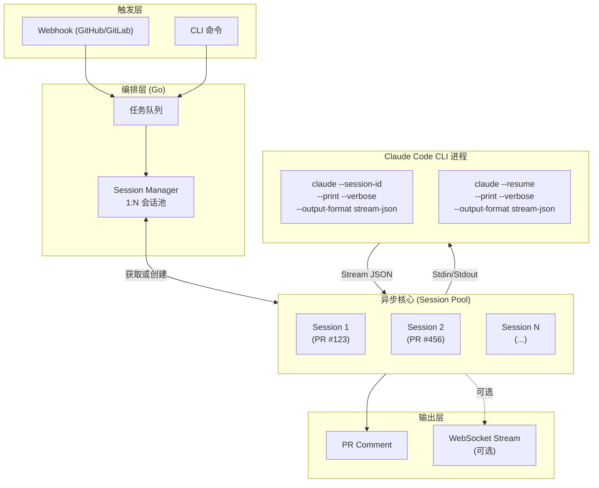
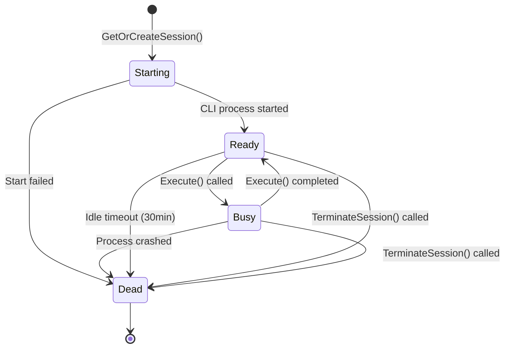

# CICD Runner 异步架构升级规格说明书

**Status**: Draft (Enhanced)
**Version**: 1.1
**Date**: 2025-02-03
**Reference**: [DivineSense CC Runner Async Arch](/Users/huangzhonghui/divinesense/docs/specs/cc_runner_async_arch.md)

---

## 1. 概述 (Overview)

### 1.1 当前架构分析

CICD Runner 当前采用 **一次性执行 (One-shot)** 模式：

```
[Webhook/CLI] -> [Runner.Execute()] -> [启动 claude CLI] -> [等待结果] -> [关闭进程] -> [返回]
```

**痛点**:
1. **冷启动开销**: 每次执行都需要启动新的 Claude Code CLI 进程 (~1-2秒)
2. **无会话保持**: 无法跨请求复用 AI 上下文
3. **单向通信**: 执行期间无法中断或注入用户反馈
4. **资源浪费**: 频繁进程创建/销毁

### 1.2 升级目标

参考 DivineSense 的异步架构，将 CICD Runner 升级为：

| 特性 | 当前 (One-shot) | 目标 (Async Persistent) |
|------|----------------|------------------------|
| 进程生命周期 | 请求结束即销毁 | 进程池保持存活 (30min idle) |
| 通信模式 | 单向 (CLI -> 结果) | 全双工 (双向流式) |
| 输出方式 | 完成后返回 | 实时流式 Token 级输出 |
| 会话管理 | 无状态 | 显式 SessionID 持久化 |
| 并发能力 | 串行执行 | 1:N 会话池并发 |

---

## 2. 架构设计 (Architecture)

### 2.1 系统架构图



### 2.2 核心组件

```
pkg/async/
├── session/
│   ├── manager.go        # SessionManager 接口与实现
│   ├── session.go        # Session 结构体与生命周期
│   └── pool.go           # SessionPool 资源池
├── stream/
│   ├── bidi.go           # 双向流处理器
│   ├── protocol.go       # 消息协议定义
│   └── parser.go         # Stream JSON 解析器 (复用 claude/stream_parser.go)
├── transport/
│   ├── websocket.go      # WebSocket 传输层 (可选)
│   └── stdio.go          # Stdio 传输层
└── registry/
    └── uuid.go           # UUID v5 映射 (ConversationID -> SessionID)
```

---

## 3. 会话管理 (Session Management)

### 3.1 SessionManager 接口

```go
// Package session provides persistent session management for AI backends
package session

import (
    "context"
    "io"
    "time"
)

// SessionStatus represents the current state of a session
type SessionStatus string

const (
    StatusStarting SessionStatus = "starting"
    StatusReady    SessionStatus = "ready"
    StatusBusy     SessionStatus = "busy"
    StatusDead     SessionStatus = "dead"
)

// Session represents a single AI backend process with persistent state
type Session struct {
    ID          string                 // UUID v5 derived from conversation ID
    Cmd         *exec.Cmd              // Underlying process
    Stdin       io.WriteCloser         // Input pipe
    Stdout      io.ReadCloser          // Output pipe
    Stderr      io.ReadCloser          // Error pipe
    Cancel      context.CancelFunc     // Forced termination
    CreatedAt   time.Time              // Creation timestamp
    LastActive  time.Time              // Last activity timestamp
    Status      SessionStatus          // Current state
    Metadata    map[string]string      // PR ID, repo, etc.

    mu          sync.RWMutex           // Concurrent access protection
}

// Manager manages the lifecycle of multiple sessions
type Manager interface {
    // GetOrCreateSession returns an existing session or creates a new one
    GetOrCreateSession(ctx context.Context, sessionID string, config SessionConfig) (*Session, error)

    // TerminateSession gracefully shuts down a session
    TerminateSession(sessionID string) error

    // ListActiveSessions returns metadata for all active sessions
    ListActiveSessions() []SessionMeta

    // CleanupIdleSessions removes sessions that have been idle longer than timeout
    CleanupIdleSessions(timeout time.Duration) int
}

// SessionConfig contains configuration for new sessions
type SessionConfig struct {
    Model           string        // sonnet, opus, haiku
    MaxTurns        int           // Maximum reasoning iterations
    MaxBudgetUSD    float64       // Budget limit
    Timeout         time.Duration // Execution timeout
    Skills          []string      // Skills to load
    WorkingDir      string        // Working directory
    Metadata        map[string]string // PR ID, repo, etc.
}

// SessionMeta contains summary information about a session
type SessionMeta struct {
    ID         string
    Status     SessionStatus
    CreatedAt  time.Time
    LastActive time.Time
    Metadata   map[string]string
}
```

### 3.2 会话映射策略

采用 **UUID v5 确定性映射**（与 DivineSense 一致）：

```go
// Package registry provides deterministic session ID mapping
package registry

import (
    "github.com/google/uuid"
)

// Namespace for CICD Runner session IDs
var SessionNamespace = uuid.MustParse("6ba7b810-9dad-11d1-80b4-00c04fd430c8")

// SessionIDFromConversationID generates a deterministic UUID v5 from a conversation ID
// This ensures the same conversation always maps to the same session, enabling resume
func SessionIDFromConversationID(conversationID int64) string {
    // Convert conversation ID to bytes and generate UUID v5
    data := []byte(fmt.Sprintf("cicd-runner:conversation:%d", conversationID))
    return uuid.NewSHA1(SessionNamespace, data).String()
}

// SessionIDFromPR generates a session ID from PR number and repository
func SessionIDFromPR(owner, repo string, prNumber int) string {
    key := fmt.Sprintf("cicd-runner:pr:%s:%s:%d", owner, repo, prNumber)
    data := []byte(key)
    return uuid.NewSHA1(SessionNamespace, data).String()
}
```

### 3.3 会话生命周期



---

## 4. 双向流式通信 (Bi-directional Streaming)

### 4.1 流式协议

复用现有的 `claude/stream_parser.go`，扩展为双向协议：

```go
// Package stream provides bi-directional streaming for AI backends
package stream

// MessageType represents the type of message in the stream
type MessageType string

const (
    // User input types
    MessageTypeUser   MessageType = "user"    // User message input
    MessageTypeCancel MessageType = "cancel"  // Cancel current execution
    MessageTypeFeedback MessageType = "feedback" // Inject feedback during execution

    // AI output types (aligned with claude.StreamEventType)
    MessageTypeThinking      MessageType = "thinking"
    MessageTypeContentDelta  MessageType = "content_block_delta"
    MessageTypeToolUse       MessageType = "tool_use"
    MessageTypeToolResult    MessageType = "tool_result"
    MessageTypeResult        MessageType = "result"
    MessageTypeError         MessageType = "error"
)

// StreamMessage represents a message in the bi-directional stream
type StreamMessage struct {
    Type      MessageType   `json:"type"`
    SessionID string        `json:"session_id,omitempty"`
    Content   string        `json:"content,omitempty"`
    Data      json.RawMessage `json:"data,omitempty"`
    Timestamp int64         `json:"timestamp"`
    Metadata  MessageMeta   `json:"metadata,omitempty"`
}

// MessageMeta contains optional metadata
type MessageMeta struct {
    ToolName  string `json:"tool_name,omitempty"`
    ToolID    string `json:"tool_id,omitempty"`
    IsError   bool   `json:"is_error,omitempty"`
    FilePath  string `json:"file_path,omitempty"`
}
```

### 4.2 BiDirectionalStreamer

```go
// BiDirectionalStreamer manages bi-directional communication with a CLI process
type BiDirectionalStreamer struct {
    session *session.Session
    encoder *json.Encoder
    decoder *json.Decoder
    handler EventHandler

    mu      sync.Mutex
}

// EventHandler handles stream events (extends claude.EventHandler)
type EventHandler interface {
    claude.EventHandler

    // OnSessionStart is called when a session starts
    OnSessionStart(sessionID string)

    // OnSessionEnd is called when a session ends
    OnSessionEnd(sessionID string, err error)

    // OnUserInputAck is called when user input is acknowledged
    OnUserInputAck(sessionID string)
}

// WriteInput writes user input to the CLI process
func (s *BiDirectionalStreamer) WriteInput(ctx context.Context, msg StreamMessage) error {
    s.mu.Lock()
    defer s.mu.Unlock()

    msg.Timestamp = time.Now().Unix()

    if err := s.encoder.Encode(msg); err != nil {
        return fmt.Errorf("failed to encode message: %w", err)
    }

    return nil
}

// StartStreaming begins reading from stdout and parsing events
func (s *BiDirectionalStreamer) StartStreaming(ctx context.Context) error {
    // Use existing claude.StreamParser
    parser := claude.NewStreamParser(s.session.Stdout, s.handler)

    // Parse in background
    go func() {
        if err := parser.Parse(); err != nil {
            s.handler.OnError(claude.StreamEvent{
                Type:  claude.EventTypeError,
                Error: err.Error(),
            })
        }
    }()

    return nil
}
```

---

## 5. 集成现有组件

### 5.1 Runner 层改造

```go
// pkg/runner/async_runner.go

// AsyncRunner extends DefaultRunner with persistent session support
type AsyncRunner struct {
    *DefaultRunner                    // Embed existing runner
    sessionMgr   session.Manager      // Session manager
    streamer     *stream.BiDirectionalStreamer
}

// ReviewAsync runs code review with persistent session
func (r *AsyncRunner) ReviewAsync(ctx context.Context, opts ReviewOptions) (<-chan StreamEvent, error) {
    // Generate deterministic session ID from PR
    sessionID := registry.SessionIDFromPR(opts.Owner, opts.Repo, opts.PRID)

    // Get or create session
    sess, err := r.sessionMgr.GetOrCreateSession(ctx, sessionID, session.SessionConfig{
        Model:    r.cfg.Claude.Model,
        MaxTurns: r.cfg.Claude.MaxTurns,
        Skills:   r.getReviewSkills(opts.Skills),
        Metadata: map[string]string{
            "pr_id":  fmt.Sprintf("%d", opts.PRID),
            "repo":   opts.Repo,
            "owner":  opts.Owner,
        },
    })
    if err != nil {
        return nil, fmt.Errorf("failed to get session: %w", err)
    }

    // Create event channel
    eventChan := make(chan StreamEvent, 100)

    // Setup event handler
    handler := &channelEventHandler{ch: eventChan}

    // Create streamer
    streamer := stream.NewBiDirectionalStreamer(sess, handler)

    // Build diff context
    diffContext := r.buildDiffContext(opts.Diff, opts.PRID)

    // Send review request
    if err := streamer.WriteInput(ctx, stream.StreamMessage{
        Type:    stream.MessageTypeUser,
        Content: diffContext,
    }); err != nil {
        return nil, fmt.Errorf("failed to send review request: %w", err)
    }

    // Start streaming
    if err := streamer.StartStreaming(ctx); err != nil {
        return nil, fmt.Errorf("failed to start streaming: %w", err)
    }

    return eventChan, nil
}
```

### 5.2 复用现有组件

| 组件 | 复用方式 | 说明 |
|------|---------|------|
| `pkg/claude/stream_parser.go` | 直接复用 | Stream JSON 解析已实现 |
| `pkg/ai/brain.go` | 扩展 | 添加 `ExecuteAsync()` 方法 |
| `pkg/mcp/server.go` | 保持不变 | MCP 服务独立运行 |
| `pkg/runner/impl.go` | 扩展 | 添加异步执行路径 |

---

## 6. 配置扩展

### 6.1 新增配置项

```yaml
# config.yaml

# 异步会话配置
async:
  enabled: true                  # 是否启用异步模式
  max_sessions: 10               # 最大并发会话数
  idle_timeout: 30m              # 会话空闲超时
  session_persistence: true      # 是否持久化会话

  # 进程管理
  graceful_shutdown_timeout: 10s # 优雅关闭超时
  force_kill_timeout: 5s         # 强制终止超时

  # 流式输出
  stream_output: true            # 是否启用流式输出
  buffer_size: 4096              # 输出缓冲区大小

# Claude 配置 (扩展)
claude:
  # 现有配置保持不变...
  model: sonnet
  output_format: stream-json     # 改为 stream-json
  verbose: true                  # stream-json 必需

  # 新增会话配置
  session_strategy: explicit     # explicit | directory
  session_namespace: "cicd-runner"
```

---

## 7. 实施路线图 (Implementation Roadmap)

### Phase 1: 基础会话管理 (1-2周)

**目标**: 实现 SessionManager 和基础会话生命周期

| 任务 | 文件 | 优先级 |
|------|------|-------|
| 实现 `session.Manager` 接口 | `pkg/async/session/manager.go` | P0 |
| 实现 `session.Session` 结构 | `pkg/async/session/session.go` | P0 |
| 实现 UUID v5 映射 | `pkg/async/registry/uuid.go` | P0 |
| 单元测试 | `pkg/async/session/*_test.go` | P0 |

**验收标准**:
- [ ] 可以创建和终止会话
- [ ] 会话在超时后自动清理
- [ ] 单元测试覆盖率 > 80%

### Phase 2: 双向流式通信 (1-2周)

**目标**: 实现双向流式协议

| 任务 | 文件 | 优先级 |
|------|------|-------|
| 扩展 `stream_parser.go` 支持双向 | `pkg/async/stream/bidi.go` | P0 |
| 定义流式消息协议 | `pkg/async/stream/protocol.go` | P0 |
| 实现 `BiDirectionalStreamer` | `pkg/async/stream/streamer.go` | P0 |
| 集成测试 | `pkg/async/stream/*_test.go` | P1 |

**验收标准**:
- [ ] 可以向 CLI 发送用户输入
- [ ] 可以实时接收 CLI 输出
- [ ] 支持 cancel 操作

### Phase 3: Runner 层集成 (1周)

**目标**: 将异步能力集成到现有 Runner

| 任务 | 文件 | 优先级 |
|------|------|-------|
| 实现 `AsyncRunner` | `pkg/runner/async_runner.go` | P0 |
| 扩展 `Brain` 接口 | `pkg/ai/brain.go` | P1 |
| 更新配置加载 | `pkg/config/load.go` | P1 |
| 集成测试 | `pkg/runner/async_test.go` | P1 |

**验收标准**:
- [ ] 现有 Review 功能向后兼容
- [ ] 可以切换到异步模式
- [ ] 缓存仍然有效

### Phase 4: Webhook 集成 (1周)

**目标**: Webhook 触发异步执行

| 任务 | 文件 | 优先级 |
|------|------|-------|
| 异步 Webhook 处理 | `pkg/webhook/async.go` | P1 |
| 状态 API 端点 | `cmd/cicd-webhook/status.go` | P2 |
| 流式 SSE 端点 (可选) | `cmd/cicd-webhook/stream.go` | P3 |

**验收标准**:
- [ ] Webhook 立即返回 202
- [ ] 后台异步执行
- [ ] 可查询执行状态

---

## 8. 兼容性与迁移

### 8.1 向后兼容

- **默认行为**: 保持 One-shot 模式为默认
- **显式启用**: 通过 `async.enabled: true` 启用
- **降级策略**: 进程启动失败时自动降级到 One-shot

### 8.2 迁移路径

```go
// 逐步迁移代码
func NewRunner(cfg *config.Config, platform platform.Platform) (*Runner, error) {
    baseRunner := &DefaultRunner{...}

    // 如果启用异步，包装为 AsyncRunner
    if cfg.Async.Enabled {
        return NewAsyncRunner(baseRunner, cfg)
    }

    return baseRunner, nil
}
```

---

## 9. 安全与风控

### 9.1 权限管理

| 风险 | 缓解措施 |
|------|---------|
| 持久化进程被劫持 | 进程隔离 + 环境变量隔离 |
| 会话劫持 | SessionID 验证 + UUID v5 |
| 资源耗尽 | 会话池上限 + 空闲超时 |

### 9.2 进程安全

- **工作目录限制**: 强制在 Git 仓库内运行
- **超时保护**: 单次执行超时 + 会话空闲超时
- **资源限制**: CPU/内存 cgroup 限制 (systemd)

---

## 10. 性能指标

| 指标 | One-shot | Async | 改进 |
|------|----------|-------|------|
| 首次执行延迟 | ~2s | ~2s | - |
| 后续执行延迟 | ~2s | ~50ms | 40x |
| 并发能力 | 1 | 10 | 10x |
| 内存占用 (空闲) | 0 | ~50MB/sess | - |

---

## 11. 开放问题

| 问题 | 影响 | 决策 |
|------|------|------|
| 是否需要 WebSocket 支持? | 低 | Phase 4 可选 |
| 会话数据是否需要持久化到磁盘? | 中 | 依赖 CLI 自身持久化 |
| 如何处理进程崩溃恢复? | 高 | 自动重启 + 降级 One-shot |

---

## 附录 A: 参考实现

### A.1 DivineSense SessionManager

参考实现位于 `/Users/huangzhonghui/divinesense/backend/internal/agent/session_manager.go`

### A.2 Claude Code CLI 参数规范

参考 `docs/BEST_PRACTICE_CLI_AGENT.md` 第 7 节

```bash
# 首次启动
claude --print --verbose --output-format stream-json \
  --session-id <uuid> \
  "Your prompt here"

# 恢复会话
claude --print --verbose --output-format stream-json \
  --resume <uuid> \
  "Follow-up question"
```

---

## 附录 B: 现有基础设施复用分析

### B.1 可复用组件清单

基于代码库调研，以下组件可直接复用或扩展：

| 组件 | 路径 | 复用方式 | 代码量 |
|------|------|---------|--------|
| **WorkerPool** | `pkg/perf/workerpool.go` | 直接复用 | ~300 LOC |
| **SessionPool** | `pkg/claude/pool.go` | 扩展生命周期管理 | ~200 LOC |
| **StreamParser** | `pkg/claude/stream_parser.go` | 扩展为双向 | ~300 LOC |
| **Event Normalization** | `pkg/webhook/` | 直接复用 | ~400 LOC |
| **MCP Protocol** | `pkg/mcp/server.go` | 参考设计 | ~500 LOC |

**总计可复用**: ~1700 LOC 生产级代码

### B.2 WorkerPool 集成示例

```go
// pkg/async/task/executor.go
// 复用 pkg/perf/workerpool.go 处理异步任务

type AsyncExecutor struct {
    pool    *perf.WorkerPool
    mgr     *session.Manager
    metrics *MetricsCollector
}

func (e *AsyncExecutor) SubmitReview(ctx context.Context, opts ReviewOptions) (*AsyncResult, error) {
    result := &AsyncResult{
        ID:        generateTaskID(),
        Status:    TaskStatusPending,
        CreatedAt: time.Now(),
    }

    // 提交到 worker pool 异步执行
    if err := e.pool.Submit(func(ctx context.Context) error {
        return e.executeReview(ctx, opts, result)
    }); err != nil {
        return nil, fmt.Errorf("task queue full: %w", err)
    }

    return result, nil
}
```

### B.3 SessionPool 扩展点

现有的 `pkg/claude/pool.go` 已实现：
- ✅ TTL-based cleanup (24小时)
- ✅ Thread-safe session map
- ✅ Session metadata tracking

需要扩展：
- ❌ 进程持久化（当前是无状态的）
- ❌ 双向通信管道
- ❌ 会话状态机 (Starting → Ready → Busy → Dead)

---

## 附录 C: 错误处理与恢复策略

### C.1 错误分类

```go
// pkg/async/errors/errors.go

type ErrorCategory string

const (
    // 瞬态错误 - 可重试
    ErrorCategoryTransient ErrorCategory = "transient"

    // 会话错误 - 需要重建会话
    ErrorCategorySession ErrorCategory = "session"

    // 配置错误 - 需要人工介入
    ErrorCategoryConfig ErrorCategory = "config"

    // 平台错误 - API 限流等
    ErrorCategoryPlatform ErrorCategory = "platform"
)

type AsyncError struct {
    Category    ErrorCategory
    Retryable   bool
    SessionID   string
    OriginalErr error
    Timestamp   time.Time
}
```

### C.2 重试策略

```go
// pkg/async/retry/policy.go

type RetryPolicy struct {
    MaxAttempts     int           // 最大重试次数
    InitialDelay    time.Duration // 初始延迟
    MaxDelay        time.Duration // 最大延迟
    BackoffFactor   float64       // 退避因子
    RetryableErrors []ErrorCategory
}

// 默认重试策略
var DefaultRetryPolicy = &RetryPolicy{
    MaxAttempts:     3,
    InitialDelay:    1 * time.Second,
    MaxDelay:        30 * time.Second,
    BackoffFactor:   2.0,
    RetryableErrors: []ErrorCategory{ErrorCategoryTransient, ErrorCategoryPlatform},
}

// 指数退避实现
func (p *RetryPolicy) NextDelay(attempt int) time.Duration {
    delay := float64(p.InitialDelay) * math.Pow(p.BackoffFactor, float64(attempt))
    if delay > float64(p.MaxDelay) {
        return p.MaxDelay
    }
    return time.Duration(delay)
}
```

### C.3 熔断器模式

```go
// pkg/async/circuitbreaker/breaker.go

type CircuitBreakerState string

const (
    StateClosed   CircuitBreakerState = "closed"   // 正常
    StateOpen     CircuitBreakerState = "open"     // 熔断
    StateHalfOpen CircuitBreakerState = "half-open" // 半开（试探）
)

type CircuitBreaker struct {
    mu              sync.RWMutex
    state           CircuitBreakerState
    failureCount    int
    failureThreshold int
    successCount    int
    successThreshold int
    lastFailureTime  time.Time
    openTimeout     time.Duration
}

func (cb *CircuitBreaker) Execute(fn func() error) error {
    if !cb.canProceed() {
        return ErrCircuitBreakerOpen
    }

    err := fn()
    cb.recordResult(err)
    return err
}
```

---

## 附录 D: 可观测性设计

### D.1 指标体系

```go
// pkg/async/observability/metrics.go

type SessionMetrics struct {
    // 会话指标
    ActiveSessions    prometheus.Gauge
    TotalSessions      prometheus.Counter
    SessionDuration    prometheus.Histogram

    // 执行指标
    TasksExecuted      prometheus.Counter
    TasksSucceeded     prometheus.Counter
    TasksFailed        prometheus.Counter
    TaskDuration       prometheus.Histogram

    // 错误指标
    ErrorsByCategory   *prometheus.CounterVec
    ErrorsBySession    *prometheus.CounterVec

    // 资源指标
    MemoryUsage        prometheus.Gauge
    QueueDepth         prometheus.Gauge
    CPUUsage           prometheus.Gauge
}

// 指标定义
var (
    sessionActive = prometheus.NewGauge(prometheus.GaugeOpts{
        Name: "cicd_async_sessions_active",
        Help: "Number of active async sessions",
    })

    taskDuration = prometheus.NewHistogram(prometheus.HistogramOpts{
        Name:    "cicd_async_task_duration_seconds",
        Help:    "Task execution duration in seconds",
        Buckets: prometheus.DefBuckets,
    })

    errorsTotal = prometheus.NewCounterVec(prometheus.CounterOpts{
        Name: "cicd_async_errors_total",
        Help: "Total number of errors by category",
    }, []string{"category", "session_id"})
)
```

### D.2 结构化日志

```go
// pkg/async/observability/logger.go

type AsyncLogger struct {
    logger *slog.Logger
    attrs  []slog.Attr
}

func (l *AsyncLogger) LogSessionEvent(sessionID, event string, attrs ...slog.Attr) {
    allAttrs := append([]slog.Attr{
        slog.String("component", "async"),
        slog.String("session_id", sessionID),
        slog.String("event", event),
        slog.Time("timestamp", time.Now()),
    }, l.attrs...)
    allAttrs = append(allAttrs, attrs...)

    l.logger.LogAttrs(context.Background(), slog.LevelInfo, allAttrs...)
}

// 事件类型
const (
    EventSessionCreated   = "session_created"
    EventSessionTerminated = "session_terminated"
    EventSessionIdleTimeout = "session_idle_timeout"
    EventSessionResumed    = "session_resumed"
    EventTaskSubmitted     = "task_submitted"
    EventTaskCompleted     = "task_completed"
    EventTaskFailed        = "task_failed"
)
```

### D.3 追踪 (Tracing)

```go
// pkg/async/observability/tracing.go

import (
    "context"
    "go.opentelemetry.io/otel"
    "go.opentelemetry.io/otel/trace"
)

type TracedSession struct {
    *session.Session
    tracer trace.Tracer
}

func (s *TracedSession) Execute(ctx context.Context, opts ExecuteOptions) (*Output, error) {
    ctx, span := s.tracer.Start(ctx, "Session.Execute",
        trace.WithAttributes(
            attribute.String("session.id", s.ID),
            attribute.String("session.model", opts.Model),
        ),
    )
    defer span.End()

    output, err := s.Session.Execute(ctx, opts)

    if err != nil {
        span.RecordError(err)
        span.SetStatus(codes.Error, err.Error())
    } else {
        span.SetStatus(codes.Ok, "success")
    }

    return output, err
}
```

---

## 附录 E: 降级与容错策略

### E.1 降级层级

```go
// pkg/async/fallback/strategy.go

type FallbackLevel int

const (
    // Level 0: 完全异步模式
    FallbackLevelAsync FallbackLevel = iota

    // Level 1: 同步模式但复用会话
    FallbackLevelSyncWithSession

    // Level 2: 传统 One-shot 模式
    FallbackLevelOneShot
)

type FallbackStrategy struct {
    currentLevel FallbackLevel
    conditions   map[FallbackLevel]Condition
}

type Condition struct {
    MaxConcurrentSessions int
    MaxMemoryUsage       int64
    MaxQueueDepth        int
    ErrorRate            float64
}

func (s *FallbackStrategy) Evaluate() FallbackLevel {
    stats := collectSystemStats()

    for level := len(s.conditions) - 1; level >= 0; level-- {
        if s.conditions[level].Satisfied(stats) {
            return FallbackLevel(level)
        }
    }

    return FallbackLevelAsync
}
```

### E.2 健康检查

```go
// pkg/async/health/checker.go

type HealthStatus string

const (
    HealthStatusHealthy   HealthStatus = "healthy"
    HealthStatusDegraded  HealthStatus = "degraded"
    HealthStatusUnhealthy HealthStatus = "unhealthy"
)

type HealthChecker struct {
    checks []HealthCheck
}

type HealthCheck interface {
    Name() string
    Check(ctx context.Context) error
}

func (h *HealthChecker) OverallStatus() HealthStatus {
    failed := 0
    for _, check := range h.checks {
        if err := check.Check(context.Background()); err != nil {
            failed++
        }
    }

    switch {
    case failed == 0:
        return HealthStatusHealthy
    case failed < len(h.checks)/2:
        return HealthStatusDegraded
    default:
        return HealthStatusUnhealthy
    }
}

// 内置健康检查
var builtinChecks = []HealthCheck{
    &SessionPoolCheck{MaxIdleTime: 5 * time.Minute},
    &MemoryCheck{Threshold: 1 << 30}, // 1GB
    &QueueDepthCheck{MaxDepth: 100},
    &ProcessHealthCheck{},
}
```

---

## 附录 F: 配置示例

### F.1 完整配置文件

```yaml
# config.yaml - 完整异步配置示例

version: "1.0"

# === 异步会话配置 ===
async:
  # 启用/禁用异步模式
  enabled: true

  # 会话池配置
  max_sessions: 10              # 最大并发会话数
  min_idle_sessions: 2          # 保持的最小空闲会话数（预热）
  idle_timeout: 30m             # 会话空闲超时
  startup_timeout: 30s          # 会话启动超时

  # 队列配置
  queue_size: 100               # 任务队列大小
  queue_timeout: 5s             # 队列写入超时

  # 进程管理
  graceful_shutdown_timeout: 10s
  force_kill_timeout: 5s

  # 流式输出
  stream_output: true
  buffer_size: 4096
  event_channel_size: 100

  # 重试配置
  retry:
    max_attempts: 3
    initial_delay: 1s
    max_delay: 30s
    backoff_factor: 2.0

  # 熔断器配置
  circuit_breaker:
    failure_threshold: 5        # 连续失败阈值
    success_threshold: 2        # 恢复阈值
    open_timeout: 60s           # 熔断开启时长

# === Claude 配置 ===
claude:
  model: sonnet
  output_format: stream-json     # 异步模式必须使用 stream-json
  verbose: true

  max_turns: 10
  max_budget_usd: 1.0
  timeout: 5m

  # 会话策略
  session_strategy: explicit     # explicit | directory
  session_namespace: "cicd-runner"
  session_ttl: 24h               # 会话持久化时长

# === 可观测性 ===
observability:
  # Prometheus 指标
  metrics_enabled: true
  metrics_port: 9090

  # 结构化日志
  log_level: info
  log_format: json               # json | text

  # 分布式追踪
  tracing_enabled: false          # 可选
  tracing_sampler: 0.1            # 10% 采样

  # 健康检查
  health_check_enabled: true
  health_check_interval: 30s

# === 降级策略 ===
fallback:
  enabled: true
  auto_downgrade: true

  conditions:
    degraded_when_memory_above: 1GB
    degraded_when_queue_depth_above: 80
    degraded_when_error_rate_above: 0.1

  one_shot_when_memory_above: 2GB
  one_shot_when_consecutive_failures: 5
```

### F.2 环境变量配置

```bash
# .env 或 systemd environment

# 异步模式开关
ASYNC_ENABLED=true

# 会话配置
ASYNC_MAX_SESSIONS=10
ASYNC_IDLE_TIMEOUT=30m

# Claude CLI 路径（可选，用于多版本）
CLAUDE_CLI_PATH=/usr/local/bin/claude

# 可观测性
METRICS_ENABLED=true
OTEL_EXPORTER_OTLP_ENDPOINT=http://jaeger:4318

# 资源限制
SESSION_MEMORY_LIMIT=512M
TASK_TIMEOUT=5m
```

---

## 附录 G: 部署配置

### G.1 Systemd 服务模板

```ini
# /etc/systemd/system/cicd-runner@.service
# 模板服务，支持多实例

[Unit]
Description=CICD Runner Async Agent (%i)
After=network-online.target
Wants=network-online.target

[Service]
# 服务类型
Type=notify
NotifyAccess=all

# 进程管理
ExecStart=/usr/local/bin/cicd-runner async --session-id %%i
ExecStop=/usr/local/bin/cicd-runner stop --session-id %%i
Restart=always
RestartSec=5

# 资源限制
MemoryMax=1G
CPUQuota=50%
TasksMax=100

# 环境变量
Environment="ASYNC_ENABLED=true"
Environment="ASYNC_IDLE_TIMEOUT=30m"
Environment="RUST_LOG=info"

# 安全加固
NoNewPrivileges=true
PrivateTmp=true
ProtectSystem=strict
ReadWritePaths=/var/lib/cicd-runner

[Install]
WantedBy=multi-user.target
```

### G.2 Docker Compose（可选）

```yaml
# docker-compose.yml
version: "3.8"

services:
  cicd-runner:
    image: cicd-runner:latest
    build: .

    # 环境变量
    environment:
      - ASYNC_ENABLED=true
      - ASYNC_MAX_SESSIONS=10
      - GITHUB_TOKEN=${GITHUB_TOKEN}

    # 资源限制
    deploy:
      resources:
        limits:
          cpus: "2.0"
          memory: 1G
        reservations:
          cpus: "0.5"
          memory: 256M

    # 健康检查
    healthcheck:
      test: ["CMD", "cicd-runner", "health"]
      interval: 30s
      timeout: 5s
      retries: 3

    # 卷挂载
    volumes:
      - ./config:/app/config:ro
      - ./sessions:/app/sessions
      - ./cache:/app/cache

    # 端口
    ports:
      - "8080:8080"  # HTTP API
      - "9090:9090"  # Metrics
```

---

## 附录 H: 测试策略

### H.1 单元测试

```go
// pkg/async/session/manager_test.go

func TestSessionManager_CreateSession(t *testing.T) {
    ctx := context.Background()
    mgr := NewManager(ManagerConfig{
        MaxSessions: 5,
        IdleTimeout: 30 * time.Minute,
    })

    t.Run("creates new session", func(t *testing.T) {
        sess, err := mgr.GetOrCreateSession(ctx, "test-1", SessionConfig{
            Model: "sonnet",
        })

        assert.NoError(t, err)
        assert.Equal(t, "test-1", sess.ID)
        assert.Equal(t, StatusReady, sess.Status)
    })

    t.Run("returns existing session", func(t *testing.T) {
        sess1, _ := mgr.GetOrCreateSession(ctx, "test-2", SessionConfig{})
        sess2, _ := mgr.GetOrCreateSession(ctx, "test-2", SessionConfig{})

        assert.Same(t, sess1, sess2) // 同一实例
    })

    t.Run("enforces max sessions limit", func(t *testing.T) {
        cfg := SessionConfig{Model: "sonnet"}

        // 创建到上限
        for i := 0; i < 5; i++ {
            mgr.GetOrCreateSession(ctx, fmt.Sprintf("sess-%d", i), cfg)
        }

        // 超出上限应该失败
        _, err := mgr.GetOrCreateSession(ctx, "overflow", cfg)
        assert.Error(t, err)
        assert.Equal(t, ErrSessionPoolFull, err)
    })
}

func TestSessionManager_CleanupIdleSessions(t *testing.T) {
    // 使用可控制的时钟进行测试
    ctrl := gomock.NewController(t)
    defer ctrl.Finish()

    // ... 测试逻辑
}
```

### H.2 集成测试

```go
// pkg/async/integration_test.go

func TestAsyncReviewFlow(t *testing.T) {
    if testing.Short() {
        t.Skip("skipping integration test")
    }

    ctx := context.Background()
    runner := setupAsyncRunner(t)

    t.Run("full review flow", func(t *testing.T) {
        // 1. 创建会话
        sessionID := registry.SessionIDFromPR("owner", "repo", 123)
        sess, err := runner.sessionMgr.GetOrCreateSession(ctx, sessionID, SessionConfig{})
        require.NoError(t, err)

        // 2. 提交任务
        eventCh, err := runner.ReviewAsync(ctx, ReviewOptions{
            PRID:    123,
            Diff:    loadTestDiff(t),
            Owner:   "owner",
            Repo:    "repo",
        })
        require.NoError(t, err)

        // 3. 收集事件
        var events []StreamEvent
        timeout := time.After(30 * time.Second)

    EventLoop:
        for {
            select {
            case event := <-eventCh:
                events = append(events, event)
                if event.Type == EventTypeResult {
                    break EventLoop
                }
            case <-timeout:
                t.Fatal("timeout waiting for result")
            }
        }

        // 4. 验证
        assert.NotEmpty(t, events)
        assert.True(t, hasEventType(events, EventTypeThinking))
        assert.True(t, hasEventType(events, EventTypeResult))
    })
}
```

### H.3 压力测试

```go
// pkg/async/stress_test.go

func BenchmarkSessionCreation(b *testing.B) {
    mgr := NewManager(ManagerConfig{MaxSessions: 1000})
    ctx := context.Background()

    b.ResetTimer()
    for i := 0; i < b.N; i++ {
        sessID := fmt.Sprintf("bench-%d", i%1000)
        mgr.GetOrCreateSession(ctx, sessID, SessionConfig{})
    }
}

func BenchmarkConcurrentSessions(b *testing.B) {
    mgr := NewManager(ManagerConfig{MaxSessions: 100})
    ctx := context.Background()

    b.RunParallel(func(pb *testing.PB) {
        i := 0
        for pb.Next() {
            sessID := fmt.Sprintf("parallel-%d", i%100)
            mgr.GetOrCreateSession(ctx, sessID, SessionConfig{})
            i++
        }
    })
}
```

---

## 版本历史

| 版本 | 日期 | 变更 |
|------|------|------|
| 1.0 | 2025-02-03 | 初始版本 |
| 1.1 | 2025-02-03 | 增加现有基础设施分析、错误处理、可观测性、部署配置、测试策略 |
