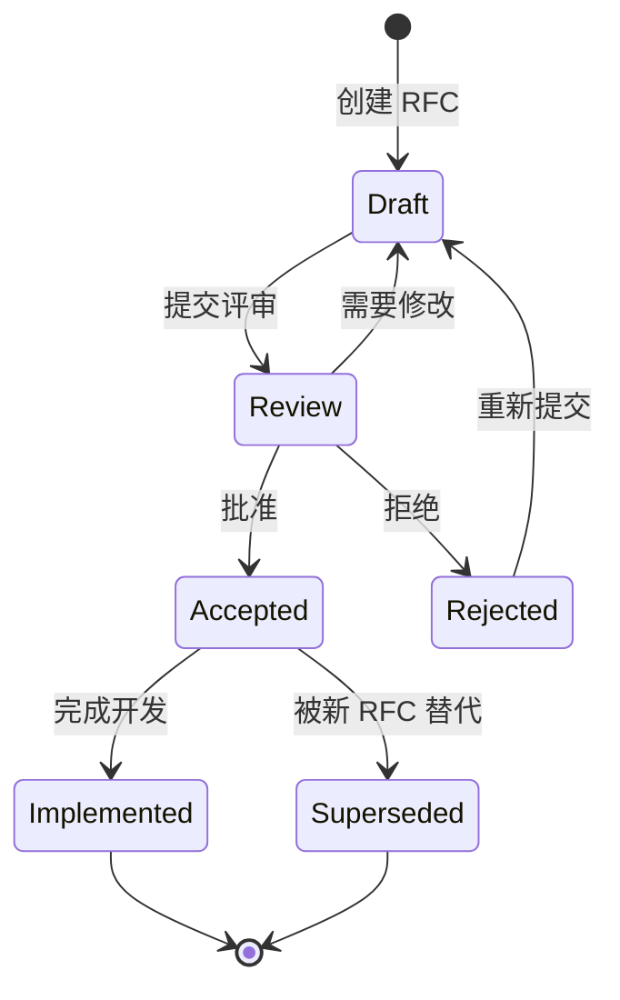

# SPEC-RFC-01: RFC (Request for Comments) Process

**Version**: 1.0
**Status**: Draft
**Date**: 2026-01-24
**Covers**: PRD 6.2 (社区建设 - RFC 流程)

## 1. 概述 (Overview)

RFC (Request for Comments) 是开源项目中进行重大设计决策、架构变更或功能迭代的标准化流程。本 Spec 定义 `cicd-ai-toolkit` 项目的 RFC 流程，确保所有重大变更都经过充分讨论、评审和共识。

## 2. 核心职责 (Core Responsibilities)

- **提案管理**: RFC 的创建、提交、跟踪和归档
- **评审流程**: 社区评审和反馈收集
- **决策机制**: 共识达成和最终批准
- **文档记录**: RFC 讨论和决策的历史记录

## 3. RFC 流程 (RFC Process)

### 3.1 流程阶段

```
┌─────────────────────────────────────────────────────────────────┐
│                        RFC 生命周期                            │
├─────────────────────────────────────────────────────────────────┤
│                                                                 │
│  1. Draft (草稿)                                                 │
│     └─ 作者创建 RFC 草案                                         │
│                                                                 │
│  2. Review (评审) ─────────────────────────────────────────┐    │
│     ├─ 社区评审和讨论                                          │    │
│     ├─ 收集反馈                                               │    │
│     └─ 可能的修改                          ┌────────────────┐    │
│                                        │  Rejected      │    │
│  3. Consensus (共识) ──────────────────┤  (返回 Draft)  │    │
│     ├─ 达成初步共识                     └────────────────┘    │
│     └─ 维护者批准                                            │    │
│                                                                 │    │
│  4. Implementation (实施)                                    │    │
│     ├─ 创建 Issue/Project                                  │    │
│     ├─ 开发实现                                              │    │
│     └─ 代码评审                                             │    │
│                                                                 │    │
│  5. Finalized (完成)                                         │    │
│     └─ RFC 标记为 Accepted                                   │    │
│                                                                 │    │
│  6. Archived (归档)                                          │    │
│     └─ 讨论历史保存                                          │    │
└─────────────────────────────────────────────────────────────────┘
```

### 3.2 RFC 类型

| 类型 | 说明 | 审批要求 | 讨论期 |
|------|------|----------|--------|
| **Standard** | 核心功能、架构变更 | 2 维护者 + 3 社区 | 14 天 |
| **Informational** | 信息性文档、设计思路 | 1 维护者 | 7 天 |
| **Process** | 流程、工具、社区改进 | 2 维护者 | 7 天 |
| **Meta-RFC** | 修改 RFC 流程本身 | 3 维护者 + 5 社区 | 21 天 |

## 4. RFC 模板 (RFC Template)

所有 RFC 必须使用以下模板：

```markdown
# RFC-XXX: [RFC 标题]

**Status**: [Draft | Review | Accepted | Rejected | Implemented]
**Type**: [Standard | Informational | Process | Meta-RFC]
**Created**: [YYYY-MM-DD]
**Author**: [@username]
**Reviewers**: [@reviewer1, @reviewer2]

## 摘要 (Abstract)
简要描述 RFC 的内容和目标（1-2 段）

## 动机 (Motivation)
### 问题陈述
当前存在什么问题？

### 目标用户
谁会受益？

### 目标
本 RFC 希望达成什么目标？

## 背景设计 (Detailed Design)
### 技术方案
详细的技术设计描述。

### 代码示例
伪代码或实际代码示例。

### 向后兼容性
对现有功能的影响。

## 替代方案 (Alternatives)
### 方案 A
描述并评估

### 方案 B
描述并评估

### 为什么选择当前方案

## 实施计划 (Implementation Plan)

| 阶段 | 任务 | 负责人 | 时间表 |
|------|------|--------|--------|
| Phase 1 | ... | ... | ... |

## 未解决问题 (Unresolved Questions)
列出需要进一步讨论的问题。

## 缺陷风险 (Drawbacks & Risks)
列出潜在的风险和缺点。

## 影响范围 (Impact)
### 现有用户
对现有用户的影响

### API 变更
API 兼容性

### 文档更新
需要更新的文档

## 参考资料 (References)
相关链接
```

## 5. RFC 工作流 (RFC Workflow)

### 5.1 RFC 提交

```bash
# 使用 CLI 创建新 RFC
cicd-runner rfc create --title "Add support for GitLab CI" \
  --type Standard \
  --authors @username \
  --reviewers @maintainer1,@maintainer2

# 或手动创建
cp .github/rfc-template.md rfcs/0123-gitlab-support.md
```

### 5.2 Pull Request 流程

1. **创建 PR**: 将 RFC 草案作为 PR 提交到 `rfcs/` 目录
2. **自动标签**: GitHub Actions 自动打上 `rfc:review` 标签
3. **评审通知**: @reviewers 和 @maintainers 自动通知
4. **讨论期**: RFC 保持 Review 状态至少最小讨论期
5. **反馈收集**: 所有评论必须在 RFC 顶部汇总

### 5.3 评审检查清单

 reviewers 应检查以下方面：

- [ ] **动机合理性**: 问题是否真实存在
- [ ] **方案完整性**: 设计是否考虑所有边界情况
- [ ] **向后兼容**: 是否破坏现有功能
- [ ] **实施可行性**: 计划是否现实可执行
- [ ] **文档质量**: RFC 是否清晰易懂
- [ ] **测试策略**: 是否包含测试计划

### 5.4 批准决策

| 决策 | 条件 | 下一步 |
|------|------|--------|
| **Accept** | 2/3 维护者同意 + 无强烈反对 | 进入实施阶段 |
| **Reject** | 维护者否决或有不可接受的缺陷 | 关闭 RFC，作者可修改后重新提交 |
| **Postpone** | 方案合理但时机不对 | 暂缓，等待合适时机 |
| **Merge** | 合并到其他 RFC | 关闭，合并到主 RFC |

## 6. RFC 目录结构

```
rfcs/
├── templates/
│   ├── rfc-template.md         # RFC 模板
│   └── acceptance-checklist.md # 审查清单
├── 0000-template.md             # 空示例 RFC
├── 0001-runner-architecture.md
├── 0002-skills-system.md
├── ...
├── active/                     # 活跃的 RFC
│   ├── README.md               # 索引和状态
│   └── ...
└── archived/                   # 已归档的 RFC
    ├── accepted/
    ├── rejected/
    └── superseded/
```

## 7. 状态管理

### 7.1 状态定义

```go
type RFCStatus string

const (
    RFCStatusDraft      RFCStatus = "draft"      // 草稿，讨论中
    RFCStatusReview    RFCStatus = "review"     // 正式评审
    RFCStatusAccepted   RFCStatus = "accepted"   // 已批准
    RFCStatusRejected   RFCStatus = "rejected"   // 已拒绝
    RFCStatusImplemented RFCStatus = "implemented" // 已实施
    RFCStatusSuperseded RFCStatus = "superseded" // 被新 RFC 替代
)
```

### 7.2 状态转换



### 7.3 自动状态管理

GitHub Actions 自动管理 RFC 状态：

```yaml
# .github/workflows/rfc-status.yml
name: RFC Status Manager

on:
  pull_request:
    paths:
      - 'rfcs/**'
  pull_request_review:
    paths:
      - 'rfcs/**'

jobs:
  manage-status:
    runs-on: ubuntu-latest
    steps:
      - uses: actions/checkout@v4

      - name: Check RFC approval
        id: check-approval
        uses: actions/github-script@v7
        with:
          script: |
            const pr = context.payload.pull_request;
            const reviews = await github.rest.pulls.listReviews({
              owner: context.repo.owner,
              repo: context.repo.repo,
              pull_number: pr.number
            });

            const maintainers = ['maintainer1', 'maintainer2'];
            const approvals = reviews.data
              .filter(r => maintainers.includes(r.user.login) && r.state === 'APPROVED');

            if (approvals.length >= 2) {
              console.log('RFC approved');
            }

      - name: Update RFC status
        if: steps.check-approval.outputs.approved == 'true'
        run: |
          # Update RFC frontmatter status
          sed -i 's/Status: Draft/Status: Accepted/' rfcs/*.md
```

## 8. RFC 评审工具

### 8.1 CLI 命令

```bash
# 创建新 RFC
cicd-runner rfc create [--title] [--type] [--authors]

# 列出活跃 RFC
cicd-runner rfc list [--status]

# 显示 RFC 详情
cicd-runner rfc show <RFC-ID>

# 提交评审
cicd-runner rfc review <RFC-ID> [--approve|--reject|--comment]

# 更新 RFC 状态
cicd-runner rfc update <RFC-ID> [--status]

# 搜索 RFC
cicd-runner rfc search <query>
```

### 8.2 GitHub 集成

```yaml
# .github/PULL_REQUEST_TEMPLATE.md
{{ if .PathMatches "rfcs/**" }}
## RFC Review Checklist

- [ ] 我已阅读并理解整个 RFC
- [ ] 动机合理，问题真实存在
- [ ] 技术方案完整且可行
- [ ] 向后兼容性已考虑
- [ ] 实施计划现实可执行
- [ ] 我的意见已在 "Reviewers Summary" 中汇总

## Reviewers Summary

@maintainers 请在此汇总评审结果：

- [ ] **批准**: RFC 可以进入实施阶段
- [ ] **拒绝**: RFC 存在不可接受的缺陷
- [ ] **修改**: 需要修改后重新评审

**评审意见**:
<!-- 请在此添加详细的评审意见 -->
{{ end }}
```

## 9. RFC 实施

### 9.1 实施跟踪

被接受的 RFC 必须有对应的 GitHub Issue 或 Project：

```bash
# RFC 批准后自动创建 Issue
cicd-runner rfc implement <RFC-ID> \
  --create-issue \
  --assignees @author1,@author2
```

### 9.2 实施验收

RFC 实施完成后需验证：

1. **Spec 更新**: 相关规格文档已更新
2. **代码实现**: 功能已按 RFC 实现
3. **测试覆盖**: 测试用例已添加
4. **文档更新**: 用户文档已更新
5. **迁移指南**: 如有破坏性变更，提供迁移指南

```bash
# 验证 RFC 实施完成
cicd-runner rfc verify <RFC-ID>
```

### 9.3 完成 RFC

```bash
# 标记 RFC 为已完成
cicd-runner rfc close <RFC-ID> \
  --status implemented \
  --related-pr #123,#456
```

## 10. 社区参与

### 10.1 评审角色

| 角色 | 职责 | 人数 |
|------|------|------|
| **Author** | RFC 提案者，回应反馈 | 1+ |
| **Reviewer** | 详细评审，提供反馈 | 2+ |
| **Maintainer** | 最终决策者 | 2+ |
| **Contributor** | 参与讨论，提出意见 | 不限 |

### 10.2 评审期望

- **响应时间**: Reviewers 应在 7 天内给出初步反馈
- **讨论礼仪**: 保持尊重，聚焦技术
- **决策透明**: 拒绝 RFC 必须给出明确理由

### 10.3 争议解决

当 RFC 存在争议时：

1. **延长讨论期**: 默认 7 天 → 14 天 → 21 天
2. **社区投票**: Maintainer 发起社区投票
3. **RFC 会议**: 定期召开社区会议讨论争议 RFC
4. **最终决策**: Project Lead 拥有最终决定权

## 11. RFC 示例

### RFC-0001: 项目初始化

```markdown
# RFC-0001: cicd-ai-toolkit 项目初始化

**Status**: Accepted
**Type**: Meta-RFC
**Created**: 2026-01-24
**Author**: @project-lead
**Reviewers**: @maintainer1, @maintainer2

## 摘要
定义 cicd-ai-toolkit 项目的基础架构、技术栈和开发流程。作为首个 RFC，同时定义 RFC 流程本身。

## 动机
### 问题陈述
需要统一的 CI/CD AI 工具集，但目前缺少基于 Claude Code 的原生方案。

### 目标用户
- DevOps 工程师
- 开源项目维护者
- 企业 CI/CD 团队

### 目标
1. 定义项目架构
2. 确定技术栈
3. 建立社区流程

## 背景设计
### 技术栈
- Runner: Go 1.21+
- Intelligence: Claude Code CLI
- Skills: Markdown + Python/Bash

### 目录结构
[详细目录结构定义...]

## 实施计划
- [x] RFC 流程定义
- [ ] 核心 Spec 编写
- [ ] MVP 开发
- [ ] 首个 Release

## 未解决问题
无

## 缺陷风险
- Claude Code API 可能变更
- 社区参与度不确定
```

## 12. 依赖关系 (Dependencies)

- **Related**: [SPEC-SKILL-01](./SPEC-SKILL-01-Skill_Definition.md) - Skill 定义标准
- **Related**: [SPEC-ECO-01](./SPEC-ECO-01-Skill_Marketplace.md) - 社区流程

## 13. 验收标准 (Acceptance Criteria)

1. **RFC 创建**: 能通过 CLI 创建符合模板的 RFC
2. **状态管理**: RFC 状态能正确跟踪和转换
3. **评审流程**: PR 评论能触发状态变更
4. **实施跟踪**: 被批准的 RFC 能创建对应的 Issue
5. **归档完整**: 所有讨论历史得到保留
